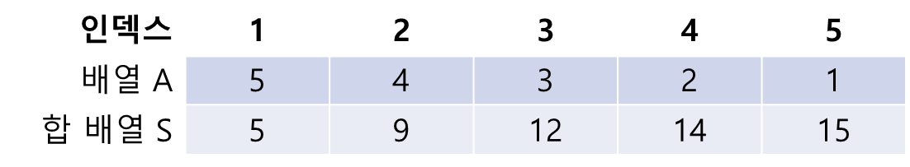

## 구간합 구하기 동적계획법 DP (Dynamic Programming)

-----
수 N 개가 주어졌을 때 i번째 수에서 j번째 수까지의 합을 구하는 프로그램

-----
#### 입력
- 1번째 줄에 숫자의 개수 N(1≦N≦100,000), 합을 구해야하는 횟수 M(1≦ M ≦ 100,000), <br>
2번째 줄에 N개의 수가 주어진다. 각 수는 1,000보다 작거나 같은 자연수다. <br>
3번째 줄부터는 M개의 줄에 합을 구해야 하는 구간 i와 j가 주어진다.
#### 출력
- 총 M개의 줄에 입력을 주어진 i번째 수에서 j번째 수 까지의 합

##### 예제
| 예제 번호 | 예제 입력                                                                               | 예제 출력            |
|:------|:------------------------------------------------------------------------------------|------------------|
| 1     | 5 3 // 데이터의 개수, 질의의 개수 <br> 5 4 3 2 1 // 구 간 합을 구할 대상 배열 <br> 1 3 <br> 2 4 <br> 5 5 | 12 <br> 9 <br> 1 |


-----
### 슈도 코드
  ```
suNo(숫자 개수), quizNo(질의 개수) 저장하기
for(숫자 개수만큼 반복하기) {
    합 배열 생성하기 (S[i] = S[i-1] + A[i])
}
for(질의 개수만큼 반복하기) {
    질의 범위받기(i ~ j)
    구간 합 출력 하기(S[j] - S[i-1])
}

  ```
-----
### 중요한 점
- 합 배열 공식(N개의 수 입력 받음 동시에 배열 생성) <br>
  `S[i] = S[i-1] + A[i]`

- 구간 합 공식(구간 i~j가 주어지면 구간합을 구하는 공식) <br>
  `S[j] - S[i-1]`<br>
  `질의 (1, 3) : S[3] - S[0] = 12 0 = 12`<br>
  `질의 (2, 4) : S[4] - S[1] = 14 5 = 9`<br>
  `질의 (5, 5) : S[5] - S[4] = 15 14 = 1`<br>

