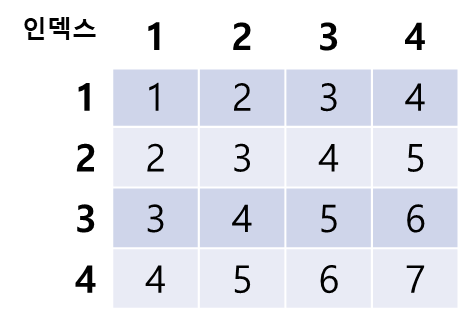
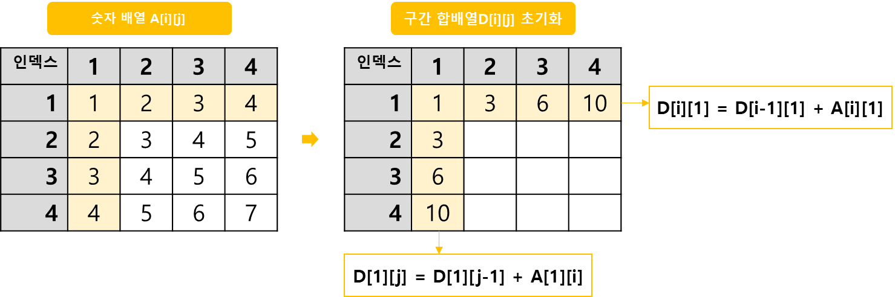
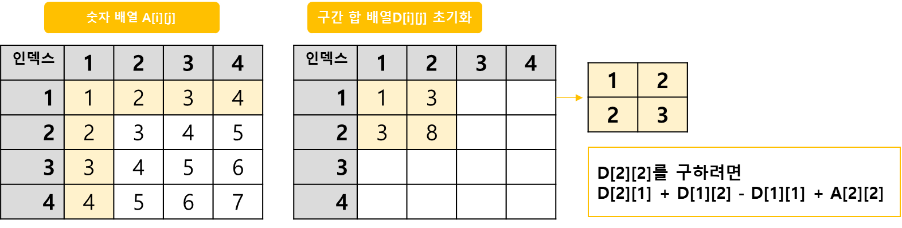
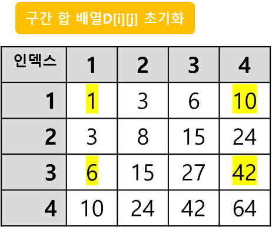

## 구간합 구하기 2 (2차원) 동적계획법 DP (Dynamic Programming)

-----
N × N개의 수가 N × N크기의 표에 채워져있다. 
표 안의 수 중(X1, Y1)에서 (X2, Y2)까지의 합을 구하려 한다. X는 행, Y는 열을 의미 
<p align="left">
  
</p>

-----
#### 입력
  1번째 줄에 표의 크기 N과 합을 구해야 하는 횟수 M이 주어진다(1≦N≦1024, 1≦M≦100,000) <br>
  2번째 줄부터 N개의 줄에는 표에 채워져 있는 수가 1행부터 차례대로 주어진다. <br>
  다음 M개의 줄에는 3개의 정수 X1, Y1, X2, Y2가 주어지며, (X1, Y1)에서 (X2, Y2)의 합을 <br>
  구해 출력 표에 채워져 있는 수는 1,000보다 작거나 같은 자연수다.(X1≦X2, Y1≦Y2)
#### 출력
- 총 M줄에 걸쳐(X1, Y1)에서 (X2, Y2)까지 합을 구해 출력

##### 예제
| 예제 입력 1                                  | 예제 출력 1 |
|------------------------------------------|---------|
| 4 3 // 2차원 배열의 크기, 구간 합 질의의 개수           | 27      |
| 1 2 3 4 // 원본 배열 1번째 줄                   | 6       |
| 2 3 4 5 // 원본 배열 2번째 줄                   | 64      |
| 3 4 5 6 // 원본 배열 3번째 줄                   |         |
| 4 5 6 7 // 원본 배열 4번째 줄                   |         |
| 2 2 3 4 // 구간 합(X1, Y1), (X2, Y2) 1번째 질의 |         |
| 3 4 3 4 // 구간 합(X1, Y1), (X2, Y2) 1번째 질의 |         |
| 1 1 4 4 // 구간 합(X1, Y1), (X2, Y2) 3번째 질의 |         |

| 예제 입력 2                                  | 예제 출력 2 |
|------------------------------------------|---------|
| 2 4 // 2차원 배열의 크기, 구간 합 질의의 개수           | 27      |
| 1 2 // 원본 배열 1번째 줄                       | 6       |
| 3 4 // 원본 배열 2번째 줄                       | 64      |
| 1 1 1 1 // 구간 합(X1, Y1), (X2, Y2) 1번째 질의 |         |
| 1 2 1 2 // 구간 합(X1, Y1), (X2, Y2) 1번째 질의 |         |
| 2 1 2 1 // 구간 합(X1, Y1), (X2, Y2) 3번째 질의 |         |
| 2 2 2 2 // 구간 합(X1, Y1), (X2, Y2) 3번째 질의 |         |


-----
### 슈도 코드
  ```
N(배열 크기) M(질의 수) 저장하기
for(N만큼 반복) { 
    for(N만큼 반복) {
        원본 배열 저장
    }
}
for(N만큼 반복) { 
    for(N만큼 반복) {
        합 배열 저장하기
        D[i][j] = D[i][j-1] + D[i-1][j] - D[i-1][j-1] + A[i][j]
    }
}
for(M만큼 반복) { 
    질의 계산 및 출력
    결과 = D[x2][y2] = D[x1-1][y2] - D[x2][y1-1] + D[x1-1][y1-1]
}
  ```
-----
### 중요한 점
- 2차원 구간 합 배열 D[X][Y] 정의 <br>
  `D[X][Y] = 원본 배열의 (0, 0)부터 (X,Y)까지의 사격형 영역 안에 있는 수의 합`
  구간 합배열의 1행, 1열의 경우
  
- D[i][j]의 값을 채우는 구간 합 공식<br>
  `D[i][j] = D[i][j-1] + D[i-1][j] - D[i-1][j-1] + A[i][j]`<br>
  `D[2][2] = D[2][1] + D[1][2] - D[1][1] + A[2][2] = 3 + 3 - 1 + 3 = 8`<br>
  
- 질의 X1, Y1, X2, Y2에 대한 답을 구간 합으로 구하는 방법 <br>
    `D[i][j] = D[i][j-1] + D[i-1][j-1] + A[i][j]`<br>
    `질의2 2 3 4 (2, 2에서 3, 4)까지의 구간 합 `<br>
    `: D[3][4] - D[1][4] - D[3][1] + D[1][1] = 42 - 10 - 6 + 1 = 27`<br>
  
