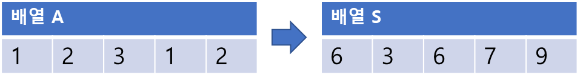
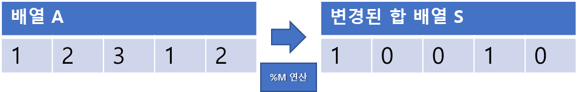

## 나머지 합 구하기

-----

N개의 수  이 주어졌을 때 연속된 부분의 합이 M으로 나누어 떨어지는 프로그램을 작성<br>
즉,  (i ≦ j)의 합이 M으로 나누어 떨어지는 (i, j) 쌍의 개수

-----
#### 입력
  1번째 줄에 N과 M(1≦N≦, 2≦M≦)<br>
  2번째 줄에 N개의 수  이 주어진다(0≦≦)
#### 출력
  1번째 줄에 연속된 부분의 합이 M으로 나누어 떨어지는 구간의 개수를 출력

##### 예제
| 예제 번호 | 예제 입력               | 예제 출력 |
|:------|:--------------------|-------|
| 1     | 5 3  <br> 1 2 3 1 2 | 7     |

-----
### 슈도 코드
  ```
N 입력받기 (수열의 개수)
M 입력받기 (나누어 떨어져야 하는 수)
S 선언하기 (합배열)
C 선언하기 (같은 나머지의 인덱스를 카운트하는 배열)
for(i →　1 ~ 1) {
    S[i] = S[i - 1] + A[i] // 합배열 저장
}
for(i →　0 ~ N) {
    remainder = S[i] % M // 합배열을 M으로 나눈 나머지 값
    if(remainder == 0) 정답을 1 증가 시키기
    C[remainder]의 값을 1 증가 시키기
}
for(i →　0 ~ M) {
    C[i](i가 나머지인 인덱스의 개수)에서 2가지를 뽑는 경우의 수를 정답에 더하기
    // C[i]개 중 2개를 뽑는 경우의 수 계산 공식 C[i] * (C[i] - 1) / 2
}
결괏값 출력
  ```
-----
### 중요한 점
- (A + B) % C은 ((A + C) + (B + C) % C)와 같으며 특정 구간 수들의 <br>
연산을 더해 나머지 연산을 한 값과 이구간의 합의 나머지 연산을 한 값은 동일
- 구간 합 배열을 이용한 식 S[i] - S[j]는 원본 배열의 j+1부터 i까지의 구간 합
- S[i] % M의 값과 S[j] % M의 값이 같다면 (S[i] - S[j]) % M은 0. 즉 구간 갑 배열의 원소를 M으로 <br>
 나눈 나머지로 업데이트하고 S[i] 와 S[j] 가 같은 (i, j)쌍을 찾으면 원본 배열에서 j+1부터 i까지의 구간 합이<br>
 M으로 나누어 떨어진다는 것을 알 수 있다.

1. A배열의 합 배열 S를 생성

2. 합 배열 S의 모든 값을 M으로 나머지 연산을 수행해 값을 업데이트

3. 합 배열에서 원소 값이 0인 개수만 세어 정답에 추가 **+3** 
<br>(변경된 합 배열의 원소 값이 0이라는 것은 원본 배열의 0부터 i까지의 구간 합이 이미M으로 나누어 떨어진다는 뜻)
4. 변경된 합 배열에서 원소 값이 같은 인덱스의 개수(나머지 값이 같은 합 배열의 개수)
<br>변경된 합 배열에서 원소 값이 같은 2개의 원소를 뽑는 모든 경우에 수를 구하여 정답에 더하면 된다.
<br>0이 3개로 경우의 수
 
<br>
1이 3개로 경우의 수

> **총 경우의 수 : 3 + 3 + 1 = 7**