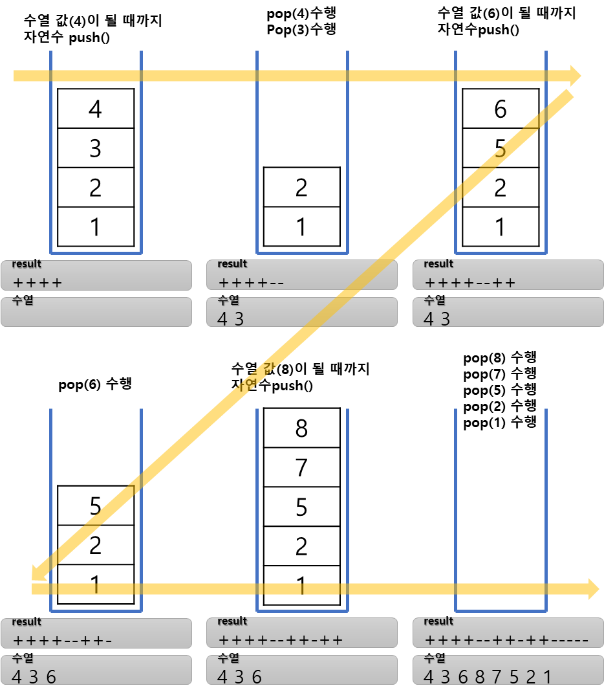

## 스택으로 오름차순 수열만들기 

https://www.acmicpc.net/problem/1874

-----
임의의 수열을 스택에서 넣었다가 출력하는 방식으로 오름차순 수열을 출력할 수 있는지
확인하고, 출력할 수 있다면 push와 pop 연산을 어떤 순서로 수행해야 하는지를 알아내는 프로그램

-----
#### 입력
- 1번째 줄에　수열의 개수 n (1 ≦ n ≦ 100,000)이 주어진다. 1번째 줄부터 n개의 줄에는  
  수열을 이루는 1이상 n이하의 정수가 1개씩 순서대로 주어진다.  
  물론 같은 정수가 두 번 나오는 일은 없다.
#### 출력
- 오름차순 수열을 만들기 우히나 연산 순서르르 출력한다. push 연산은 +, pop연산은 -로  
  출력하고, 불가능 할때는 NO를 출력한다.

##### 예제
예제 1번  

| index | 예제입력 | 예제출력 |
|-------|------|------|
| 1     | 8    | +    |
| 2     | 4    | +    |
| 3     | 3    | +    |
| 4     | 6    | +    |
| 5     | 8    | -    |
| 6     | 7    | -    |
| 7     | 5    | +    |
| 8     | 2    | +    |
| 9     | 1    | -    |
| 10    |      | +    |
| 11    |      | +    |
| 12    |      | -    |
| 13    |      | -    |
| 14    |      | -    |
| 15    |      | -    |
| 16    |      | -    |

예제 2번

| index | 예제입력 | 예제출력 |
|-------|------|------|
| 1     | 5    | NO   |
| 2     | 1    |      |
| 3     | 2    |      |
| 4     | 5    |      |
| 5     | 3    |      |
| 6     | 4    |      |


-----
### 슈도 코드
  ```
N(수열 개수) A[](수열 배열)
수열 배열 채우기
for(N만큼 반복){
    if(현재 수열의 값 >= 오름차순 자연수) {
        while(값이 같아질 때까지){
            push()
            (+)저장
        }
        pop()
        (-)저장
    } else if(현재 수열의 값 <  오름차순 자연수) {
        pop()
        if(스택 pop 결괏값 > 수열의 수) NO 출력
        else (-)저장
    }
}
if(-값을 출력한 저거이 없으면) 저장한 값 출력

  ```
-----
### 중요한 점
- 스택연산 수행방법
1. 현재 수열 값 ≧ 자연수  
   `현재 수열 값이 자연수 보다 크거나 같을 때 까지 자연수를 1씩 증가시키며 자연수를 스택에 push한다.`  
   `그리고 push가 끝나면 수열을 출력히기 위해 마지막 1회만 pop한다.`
2. 현재 수열 값 < 자연수  
   `현재 수령 값보다 자연수가 크다면 pop으로 스택에 있는 값을 꺼낸다. 껀낸 값이 현재 수열 값이거나 아닐 수 있다. 만약 아니라면 후입선출 원리에 따라 수열을 표현할 수 없으므로 NO를 출력한 후 문제를 종료하고, 현재 수열 값이라면 그대로 조건문을 빠져 나온다.`




### 스택과 큐

#### 스택
스택 (stack) - 삽입과 삭제 연산이 후입선출(LIFO : Last in First Out)로 이뤄지는 자료구조'  
깊이 우선 탐색(DFS : Depth First Search), 백트래킹 종류의 코딩테스트 문제에 효과적
후입선출은 개념 자체가 재귀 함수 알고리즘 원리와 일맥상통
##### 스택용어
위치
- top : 삽입과 삭제가 일어나는 위치
  연산
- push : top위치에 새로운 데이터를 삽입하는 연산
- pop : top 위치에 현재 잇는 데이터를 삭제하고 확인하는 연산
- peek : top위치에 현재 있는 데이터를 단순확인하는 연산

#### 큐
큐(queue) - 삽입과 삭제 연산이 선입선출(FIFO : First in First Out)로 이뤄지는 자료구조  
너비 우선 탐색(BFS : Breadth First Search)에서 자주사용
##### 큐용어
- rear : 큐에서 가장 끝 데이터를 가리키는 영역
- front : 큐에서 가장 앞의 데이터를 가리키는 영억
- add : rear부분에 새로운 데이터를 삽입하는 연산
- poll : front 부분에 있는 데이터를 삭제하고 확인하는 연산
- peek : 큐의 맨 앞(front)에 있는 데이터를 확인할 때 사용하는 연산

#### 우선순위 큐
우선순위 큐(priority queue)는 값이 들어간 순서와 상관 없이 우선순위가 높은 데이터가 먼저 나오는 자료구조  
