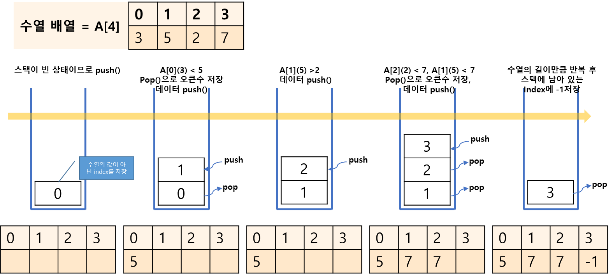

## 오큰수 구하기

https://www.acmicpc.net/problem/17298

-----
크기가 N인 수열 A= 이 있다. 수열의 각 원소 에 관련된 오큰수 NGE(i)를 구하려고 한다.  
의 오큰수는 오른 쪽에 있으면서 보다 큰 수중 가장 왼쪽에 있는 수를 의미 한다.
이러한 수가 없을 때 오큰수는 -1이다.

예) A = [3, 5, 2, 7] 일 때, NGE(1) = 5, NGE(2) = 7, NGE(3) = 7, NGE(4) = -1이다.

-----
#### 입력
- 1번째 줄에 수열 A의 크기 N (1 ≦ N ≦ 1,000,000)이 주어진다.
- 둘째 줄에 수열 A의 원소  (1 ≦  ≦ 1,000,000)이 주어진다.

#### 출력
- 총 N개의 수 NGE(1), NGE(2), ..., NGE(N)을 공백으로 구분해 출력한다.

##### 예제
예제 1번

| index | 예제입력           | 예제출력      |
|-------|----------------|-----------|
| 1     | 4 <br> 3 5 2 7 | 5 7 7 -1  |
| 2     | 4 <br> 9 5 4 8 | -1 8 8 -1 |

-----
### 슈도 코드
  ```
N(수열 개수) A[수열 배열] ans[](정답 배열)
수열 배열 채우기
최초 스택 초기화 하기
for(N만큼 반복) {
    while(스택이 비어 있지 않고, 현재 수열 값이 top에 해당하는 수열보다 클 때 까지 반복) {
        pop
        정답 배열에 오큰수를 현재 수열로 저장하기
    }
    현재 수열을 스택에 push
}
while(스택이 빌 때까지){
    스택에 있는 인덱스의 정답 배열에 -1 저장하기
} 
정답 배열 출력하기
  ```
-----
### 중요한 점
- N의 최대 크기가 1,000,000이므로 반복문으로 오큰수를 찾으면 제한시간을 초과 하게 된다.
- 스택에 새로 들어오는 수가 top에 존재하는 수보다 크면 그 수는 오큰수가 된다.
- 오큰수를 구한 수 수열에서 오큰수가 존재하지 않는 숫자에 -1을 출력해야한다.
1. 스택이 채워저 있거나 A[index] > A[top]인 경우 pop한 인덱스를 이용하여 정답 수열에 오큰수를 저장  
   pop은 조건을 만족하는 동안 계속 반복합니다. 과정 1을 마치면 2로 넘어갑니다.
2. 현재 인덱스를 스택에 push하고 다음 인덱스로 넘어갑니다.
3. 과정 1~2를 수열 길이만큼 반복한 다음 현재 스택에 남아 있는 인덱스에 -1을 저장
   

> ①처음에는 스택이 비어 있으므로 과정 1. 없이 과정 2.를 진행합니다. 인덱스 0을 push하고 다음 인덱스로 넘어 갑니다  
> ②인덱스 A[1]은 5이고 A[top]는 0이므로 스택에서 pop을 수행하고 Result[0]에 오큰수 5를 저장합니다.  
> ③1회 반복으로 스택이 비워있으므로 pop은 더 진행하지 않습니다.  
> ④인덱트 1을 push하고 다음 인덱스로 넘어 갑니다. A[2]는 2이고 A[top]은 5이므로 과정 2를 진행하여 push하고 다음인덱스로 넘어갑니다.