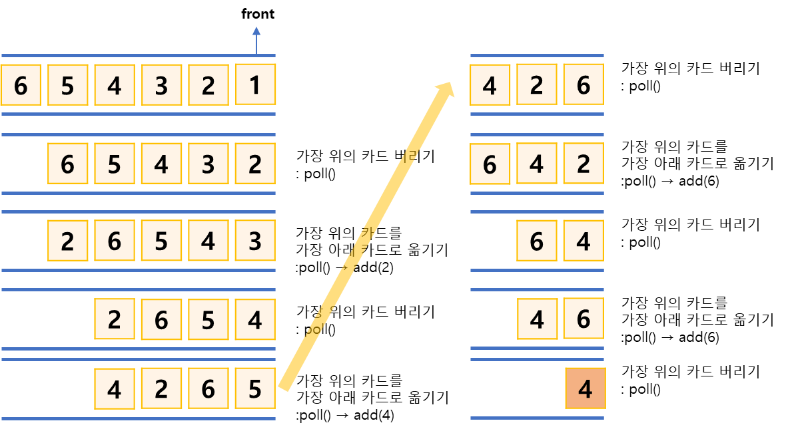

## 카드 게임

https://www.acmicpc.net/problem/2164

-----
N장의 카드가 있다. 각각의 카드는 차례로 1에서 N까지의 번호가 붙어 있으며, 1번 카드가 가장 위,  
N번 카드가 가장 아래인 상태로 놓여 였다. 이제 다음과 같은 동작을 카드가 1장 남을 때까지 반복  
우선, **제일 위에 있는 카드**를 바닥에 버린다. 그 다음, **제일 위에 있는 카드를 제일 아래에 있는 카드 밑으로 옮긴다**.

예) N = 4일 때 카드는 가장 위에서부터 1, 2, 3, 4의 순서대로 놓여 있다. 1을 버리면 2, 3, 4가 남는다.  
여기서 2를 가장 아래로 옮기면 순서가 3, 4, 2가 된다. 3을 버리면 4, 2가 남고, 4를 밑으로 옮기면 순서가 2, 4가 된다.  
마지막으로 2를 버리면 카드 4가 남는다. N이 주어지면 가장 마지막에 남는 카드를 구하는 프로그램

-----
#### 입력
- 1번째 줄에 정수 N(1 ≦ N ≦ 500,000)이 주어진다.

#### 출력
- 첫째 줄에 남게 되는 카드의 번호를 출력한다.

##### 예제
예제 1번

| index | 예제입력 | 예제출력 |
|-------|------|------|
| 1     | 6    | 4    |

-----
### 슈도 코드
  ```
N (카드의 개수) myQueue(카드 저장 자료구조)
for(카드의 개수 만큼 반복){
    큐에 카드 저장하기
}
while(카드가 1장 남을 때까지){
    맨위의 카드를 버림 : poll()
    맨위의 카드를 가장 아래의 카드 밑으로 이동 : poll() → add()
}
마지막으로 남은 카드 출력
  ```
-----
### 중요한 점
- 큐를 이해하고 있는지를 묻는 문제 
- 가장 위의 카드를 가장 아래에 있는 카드 밑으로 옮기는 동작은 큐의 선입선출을 이용
1. poll을 수행하여 맨 앞의 카드를 버린다.
2. 과정 1에 이어 바로 add를 수행해 맨 앞에 있는 카드를 가장 아래로 옮긴다.
3. 큐의 크기가 1이 될 때까지 과정 1~2를 반복한후 큐에 남아있는 원소를 출력
