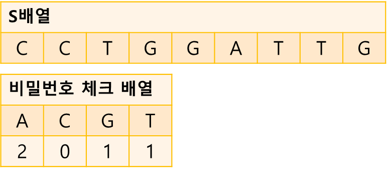
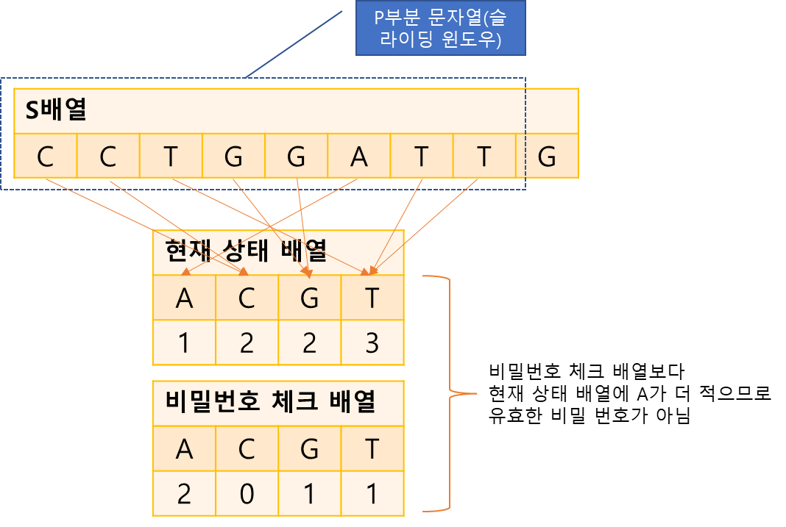
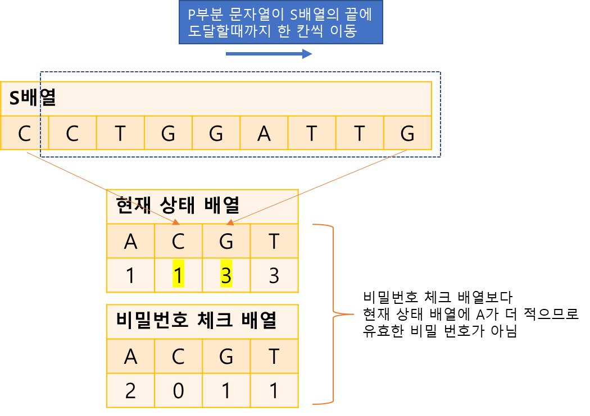

## DNA 비밀번호(슬라이딩 윈도우)

슬라이딩 윈도우 알고리즘은 2개의 포인터로 범위를 지정한 다음 범위를 유지한채로 이동하며 문제를 해결
https://www.acmicpc.net/problem/12891
-----

DNA 문자열은 모든 문자열에 등장하는 문자가 {‘A’, ‘C’, ‘G’, ‘T’} 인 문자열  
예) “ACKA”는 DNA 문자열이 아니지만 “ACCA”는 DNA 문자열이다.  
  
- “AAAA”와 같이 보안에 취약한 비밀번호  
- 임의의 DNA문자열이 “AAACCTGCCAA” 이고 민호가 뽑을 부분문자열의 길이를 4라고 하자.  
- 그리고 부분문자열에 **‘A’ 는 1개 이상, ‘C’는 1개 이상, ‘G’는 1개 이상, ‘T’는 0개 이상**이 등장해야  
비밀번호로 사용할 수 있다  
- 민호가 만든 임의의 DNA 문자열과 비밀번호로 사용할 부분분자열의 길이,   
그리고 {‘A’, ‘C’, ‘G’, ‘T’} 가 각각 몇번 이상 등장해야 비밀번호로 사용할 수 있는지 순서대로 주어졌을 때 민호가 만들 수 있는 비밀번호의 종류의 수를 구하는 프로그램
-  단 부분문자열이 등장하는 위치가 다르다면 부분문자열이 같다고 하더라도 다른 문자열로 취급한다.
-----

#### 입력
- 첫 번째 줄에 민호가 임의로 만든 DNA 문자열 길이 |S|와 비밀번호로 사용할 부분문자열의 길이 |P| 가 주어진다. (1 ≦ |P| ≦ |S| ≦ 1,000,000), 
- 두번 째 줄에는 민호가 임의로 만든 DNA 문자열이 주어진다.
- 세번 째 줄에는 부분문자열에 포함되어야 할 {‘A’, ‘C’, ‘G’, ‘T’} 의 최소 개수가 공백을 구분으로 주어진다. 각각의 수는 |S| 보다 작거나 같은 음이 아닌 정수이며 총 합은 |S| 보다 작거나 같음이 보장된다.
#### 출력
- 첫 번째 줄에 민호가 만들 수 있는 비밀번호의 종류의 수를 출력

##### 예제
| 예제 번호 | 예제 입력                                                                                                   | 예제 출력 |
|:------|:--------------------------------------------------------------------------------------------------------|-------|
| 1     | 9 8 // DNA 문자열 길이, 부분 문자열의 길이<br> CCTGGATTG // DNA 문자열<br> 2 0 1 1 // 부분 문자열에 포함돼야 할 A, C, G, T 의 최소 개수 | 0     |
| 2     | 9 8 <br> GATA <br> 1 0 0 1                                                                              | 2     |


-----
### 슈도 코드
  ```
// 데이터 저장
S(문자열 크기) P(부분 문자열의 크기)
A(문자열 데이터)
checkArr(비밀번호 체크 배열)
// 변수 선언
myArr(현재 상태 배열)
checkSecret(몇 개의 문자와 관련된 개수를 충족했는지 판단하는 변수)
P 범위(0 ~ P -1)만큼 S배열에 적용하고, 유효한 비밀번호인지 판단
for(i를 P에서 S까지 반복){
   j 선언 (i-P)
   // 이 부분은 함수로 별도 구현하기
   한 칸씩 이동하면서 제거되는 문자열과 새로 들어오는 문자열을 처리
   유효한 비밀번호인지(checkSecret == 4) 판단해 결괏값에 업데이트
}
결괏값 출력

별도 함수
Add(문자 더하기 함수){
    새로 들어온 문자를 myArr에 업데이트하거나 checkSecret 값 변경하기
}
Remove(문자 빼기 함수){
    제거되는 문자를 myArr에 업데이트하거나 checkSecret 값 변경하기
}
  ```
-----
### 중요한 점
- P와 S의 길이가 1,000,000으로 매우 크기 때문에 O(n)의 시간 복잡도 알고리즘으로 문제를 해결
- 부분 문자열의 길이가 P이므로 슬라이딩 윈도의 개념을 이요하면 문제를 해결 할 수 있다.
1. S배열과 비밀번호 체크 배열을 저장  

2. 윈도우에 포함된 문자로 현재 상태 배열을 만듭니다. 그런 다음 현재 상태 배열과 비밀번호 체크 배열을 비교하여 유효 비밀번호인지 판단

3. 윈도우를 한칸씩 이동하며 현재 상태 배열을 업데이트합니다. 
현재 상태 배열을 업데이트 한 이후에는 비밀번호 체크 배열과 비교하여 비밀번호 유효성을 판단합니다.  
현재 상태 배열을 업데이트할 때는 문자열, 신규 문자열만 보고 업데이트 하는 방식으로 진행

위 그림의 경우 윈도우를 한 칸 이동하여 C가 빠지고, G가 추가되어 현재 상태 배열을 1, 2, 2, 3에서 
1, 1, 3, 3으로 업데이트 한 것입니다. 비밀번호 체크 배열과 비교했을 때 A가 2보다 작아서 유효 비밀번호가 아니게 된다.

### 비교 해보기  
https://recordofwonseok.tistory.com/434
