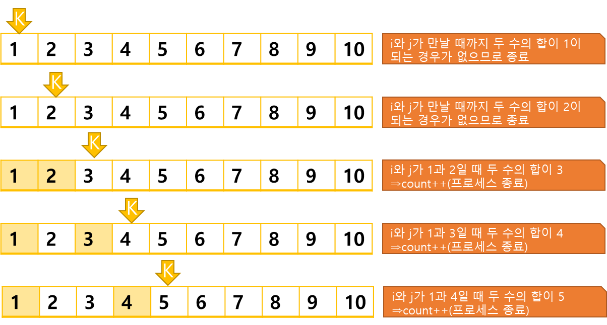

## 좋은 수 구하기
https://www.acmicpc.net/problem/1253
-----

주어진 N개의 수에서 다른 두 수의 합으로 표현되는 수 = '좋은수'  
N개의 수 중 좋은 수가 총 몇개인지.
-----
#### 입력
- 1번째 줄에 수의 개수 N(1≦ N ≦2,000), 2번째 줄에 N개의 수의 값()이 주어진다.  
(≦ 1,000,000,000, 는 정수)
#### 출력
- 좋은 수의 개수를 출력한다

##### 예제
| 예제 번호 | 예제 입력                                 | 예제 출력 |
|:------|:--------------------------------------|-------|
| 1     | 10 // 수의 개수 <br> 1 2 3 4 5 6 7 8 9 10 | 8     |

                                                                                                                                                                                                                                                                                                                                                                                                                                                                                                                                                                                                                                                                                                                                                                                                                                                                                                                                                                                                                                                                                                                                                                                                                                                                                                                                                                                                                                                                                                                                                                                                                                                                                                                                                                                                                                                                                                                                                                                                                                                                                                                                                                                                                                                                                                                                                                                                                                                                                                                                                                                                                                                                                                                                                                                                                                                                                                                                                                                                                                                                                                                                                                                                                                                                                                                                                                                                                                                                                                                
-----
### 슈도 코드
  ```
N(배열의 데이터 개수) 
A[N] 배열 선언 
for(N만큼 반복하기){
    A 배열에 데이터 저장
}

A배열 정렬하기

for(N만큼 반복하기){
    변수 초기화 하기(찾고자 하는 값 k, 포인터 i, 포인터 j)
    while(i<j){
        if(A[i] + A[j] ==  찾고자 하는 값)
            두 포인터 i, j가 k가 아닐 때 결괏값에 반영 및 while 문 종료하기
            두 포인터 i, j가 k가 맞을 때 포인터 변경 및 계속 수행
        else if(k> M)포인터 i 증가
        else 포인터 j증가
    }
}
좋은 수의 개수 출력
  ```
-----
### 중요한 점
- 시간 복잡도 N의 개수가 최대 2,000이라 가저어해도 좋은 수하나를 찾는 알고리즘의 시간 복잡도는   
보다 작아야 합니다 만약 시감 복잡도가 인 알고리즘을 사용하면 최종 시간복잡도는 이  
되므로 **최소 O(nlonn)이어야 한다**.  그러므로 정렬, 투 포인터 알고리즘을 사용하면 된다.  
단, 정렬된 데이터에서 자기 자신을 좋은 수 만들기에 포함하면 안된다.!!
- 투 포인터 이동 원칙  
  `A[i] + A[j] > k: j--; A[i] + A[j] < K: i++;  `  
  `A[i] + A[j] == K: i++; count++;  `
- 위의 이동원칙을 모든 수에 대하여 반복  
