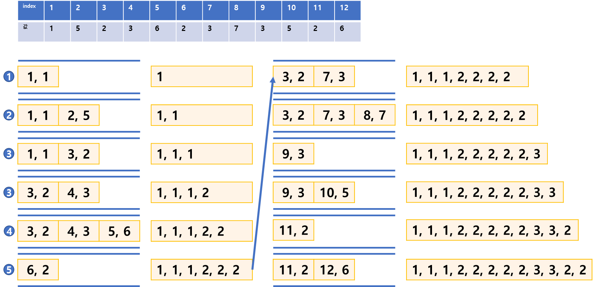
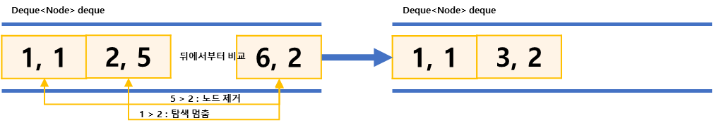

## 최솟값 찾기
https://www.acmicpc.net/problem/11003
-----
N개의 수 과 L이 주어진다.  
중의 최솟값이라고 할 때, D에 저장된 수를 출력하는 프로그램을 작성  
이때, i ≦ 0 인 는 무시하고 D를 구해야 한다.

-----
#### 입력
- 첫째 줄에 N과 L이 주어진다. (1 ≦ L ≦ N ≦ 5,000,000)
- 둘째 줄에는 N개의 수 Ai가 주어진다. (-109 ≦  ≦ 109)
#### 출력
- 첫째 줄에 를 공백으로 구분하여 순서대로 출력한다.

##### 예제
| 예제 번호 | 예제 입력                                                           | 예제 출력                   |
|:------|:----------------------------------------------------------------|-------------------------|
| 1     | 12 3 // 숫자의 개수, 슬라이딩 윈도우 크기 <br> 1 5 2 3 6 2 3 7 3 5 2 6 // 재료들 | 1 1 1 2 2 2 2 2 3 3 2 2 |


-----
### 슈도 코드
  ```
N(데이터의 개수), L(최솟값을 구하는 범위)
Deque<Node> deque(데이터를 담을 덱 자료구조)
배열 선언하기

for(N만큼 반복){
    now(현재 데이터 값)
        덱의 마지막 위치에서부터 now보다 큰 값은 덱에서 제거(나보다 값이 큰 데이터 제거(최소값))
        덱의 마지막 위치에 now값 저장하기
        덱의 1번째 위치에서부터 L의 범위를 벗어난 값(now index-L <= index)을 덱에서 제거하기
        덱의 1번째 데이터 출력
}

덱에 저장할 노드 클래스 별도 생성히기
노드 클래스에는 index(자신의 위치), value(자신의 값)담기

  ```
-----
### 중요한 점
- 일정 범위 안에서 최소값을 구하는 문제이므로 슬라이등 원도우와 정렬을 사용
- 윈도우의 크기는 문제에서 최솟값을 구하는 범위가 i-L+1부터 i까지이므로 L로 생각하면된다.
- 일반적으로 정렬은 nlong(n)의 시간복잡도를 가지므로 N과 L의 최대 범위가 5,000,000인 이문제에서는  
정렬을 사용할수 없다. 그러므로 O(n)의 시간의 시간 복잡도로 해결
- 슬라이디이 윈도우를 덱(deque)으로 구현하여 정렬효과를 볼 수 있습니다.


  1. `①번에서 (인덱스, 숫자)형태의 노드를 클래스로 구현하여 저장, 최초 (1, 1)이 덱에 추가되면 비교 대상이 없고, 범위도 만족하므로 바로 1을 출력 `  
  2. `②번의(2, 5)는 (1, 1)과 숫자를 비교했을 때 더 크므로 탐색을 멈추고 덱에 추가한다. 인덱스 범위가 1~2여서 윈도우 범위를 만족하므로 다시 1을 출력`  
  3. `③(3, 2)는 (2, 5)와 숫자를 비교했을 때 더 작으므로 (2, 5)를 덱에서 제거한다. (1,1), (3, 2)가 되고, 인덱스 범위 1~3역시 윈도우 범위를 만족하므로 다시 1을 출력`
  4. 이후 계속 반복

  
     
   `왼쪽에서는 addFirst(), removeFirst()함수가 삽입, 삭제 역활을 하고,`  
   `오른쪽에서는 addLast(), removeLast()함수가 삽입, 삭제 역활을 한다. `