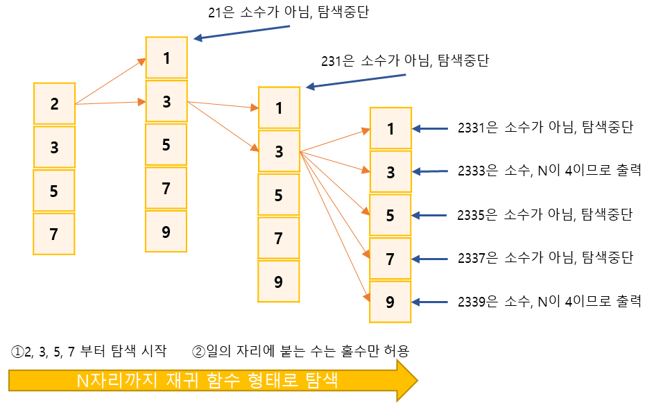

## 신기한소수 찾기
https://www.acmicpc.net/problem/2023

-----
수빈이가 세상에서 가장 좋아하는 것은 소수이고, 취미는 소수를 가지고 노는 것이다. 요즘 수빈이가 가장 관심있어 하는 소수는 7331이다.  
7331은 소수인데, 신기하게도 733도 소수이고, 73도 소수이고, 7도 소수이다. 즉, 왼쪽부터 1자리, 2자리, 3자리, 4자리 수 모두 소수이다! 수빈이는 이런 숫자를 신기한 소수라고 이름 붙였다.  
수빈이는 N자리의 숫자 중에서 어떤 수들이 신기한 소수인지 궁금해졌다. N이 주어졌을 때, 수빈이를 위해 N자리 신기한 소수를 모두 찾아보자.  

-----
#### 입력
- 1번째 줄에 N(1 ≦ N ≦ 8)이 주어진다.

#### 출력
- N자리 수 중에서 신기한 소수를 오름차순으로 정렬해서 한 줄에 하나씩 출력

##### 예제
| 예제 번호 | 예제 입력 | 예제 출력                                                                                                                                         |
|:------|:------|-----------------------------------------------------------------------------------------------------------------------------------------------|
| 1     | 4     | 2333 <br> 2339<br> 2393<br> 2399<br> 2939<br> 3119<br> 3137<br> 3733<br> 3739<br> 3793<br> 3797<br> 5939<br> 7193<br> 7331<br> 7333<br> 7393  |


-----
### 슈도 코드
  ```
n(자릿수)
DFS 실행하기(숫자 2, 3, 5, 7로 탐색)
// DFS 구현하기

DFS {
    if(자릿수 == n){
        if(소수)수 출력하기
        탐색종료
    }
    for(1 ~ 9 반복하기){
        if(뒤에 붙는 수가 홀수이면서 소수일 때)
        DFS 실행 : 자릿수 + 1, 수 * 10 + 뒤에 붙는 수
    }
}

//소수 구하기 함수
for('2 ~ 현재 수 / 2' 반복하기){
    if(나머지가 0이면) {
        return 소수가 아님
    }
}
return 소수임

  ```
-----
### 중요한 점
- DFS는 재귀 함수 형태를 가짐
- 소수란 약수가 1과 자신의 수만 가진 것을 의미(예.4는 약수가 1, 2, 4이므로 소수가아니며 7은 약수가 1, 7이므로 소수이다.)
- 자릿수가 한 개인 소수는 2, 3, 5, 7이므로 이 수부터 탐색을 시작(4, 6, 8, 9)를 제외한 가지치기 방식을 적용한 것
- 이어서 자릿수가 두 개인 현재 수 * 10+ a를 계산하여 이수가 소수인지 판단하고, 소수라면 재구 힘수로 자릿수를 하나 늘립니다.
- 단, a가 짝수 인경우 항상 2를 약수를 가지므로 가지치기로 a가 짝수인것을 제외 이방식으로 N까지 확장하였을 경우 그 값이 소수라면 해당 값을 출력  

- DFS의 형태로 탐색합니다. 그리고 첫 탐색 배열, 중간 탐색 배열을 가지치기하여 시간 복잡도를 줄였으며,  
중간 탐색 과정에서 소수가 아닌 경우 멈추는 가지치기도 포함되어 문제 해결