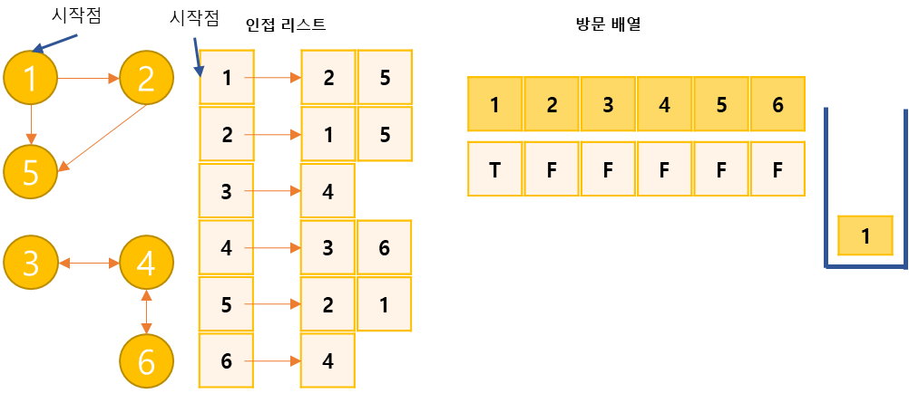
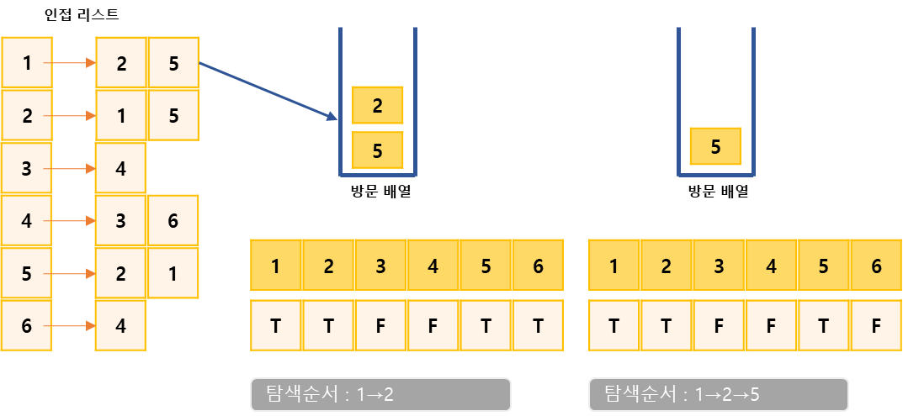
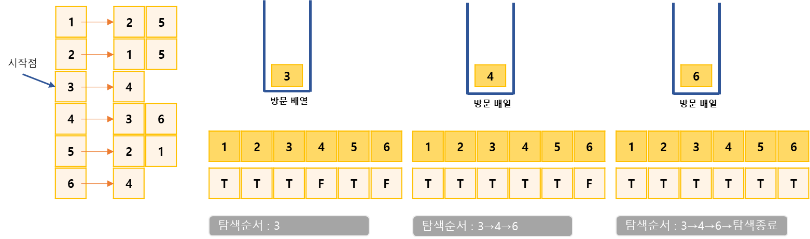

## 연결요소의 개수 구하기
https://www.acmicpc.net/problem/11724

-----
방향 없는 그래프가 주어졌을 때, 연결 요소 (Connected Component)의 개수를 구하는 프로그램을 작성

-----
#### 입력
- 1번째 줄에 정점의 개수 N과 간선의 개수 M이 주어진다. (1 ≦  N ≦  1,000, 0 ≦  M ≦  N×(N-1)/2) 
- 2번째 줄부터 M개의 줄에 간선의 양 끝점 u와 v가 주어진다. (1 ≦  u, v ≦  N, u ≠ v) 같은 간선은 한 번만 주어진다.

#### 출력
- 첫째 줄에 연결 요소의 개수를 출력

##### 예제
| 예제 번호 | 예제 입력                                                                                        | 예제 출력 |
|:------|:---------------------------------------------------------------------------------------------|-------|
| 1     | 6 5 // 노드 개수, 에지 개수 <br> 1 2 <br> 2 5 <br> 5 1 <br> 3 4 <br> 4 6                             | 2     |
| 2     | 6 8 // 노드 개수, 에지 개수 <br> 1 2 <br> 2 5 <br> 5 1 <br> 3 4 <br> 4 6 <br> 5 4 <br> 2 4 <br> 2 3  | 1     |


-----
### 슈도 코드
  ```
n(노드 개수) m(에지 개수)
arr(그래프 데이터 저장 인접 리스트)
visited(방문 기록 저장 배열)
for(n의 개수만큼 반복하기){
    arr 인접 리스트이 각 ArrayList 초기화하기
}
for(m의 개수만큼 반복하기){
    arr 인접 리스트에 그래프 데이터 저장하기
}

for(n의 개수만큼 반복하기){
    if(방분하지 않은 노드가 있으면){
        연결 요소 개수++
        DFS 실행하기
    }
}
// DFS 구현하기
DFS {
    if(현재 노드 == 방문 노드) return;
    visited 배열에 현재 노드 방문 기혹하기
    현재 노드의 연결 노드 중 방문하지 않은 노드로 DFS 실행하기(재귀 함수 상태)
}
  ```
-----
### 중요한 점
- 노드 최대 개수가 1,000이므로 시간 복잡도  이하의 알고리즘을 모두 사용가능
- 연결 요소는 에지로 연결된 노드의 집합
1. 그래프를 인접 리스트로 정장하고 방문 배열도 초기화 합니다. 방향이 없는 그래프이기 때문에 양쪽 방향으로 에지를 모드 저장

2. 임의의 시작점에서 DFS를 수행합니다. 현재의 경우 1을 시작점으로 정했습니다. 탐색을 마친이후 방문한 곳은 1, 2, 5가 되었습니다.

3. 아직 방문하지 않은 노드가 있으므로 시작점을 다시 정해 탐색을 진행합니다. 현재의 경우 3, 4, 6순서로 탐색을 마쳤습니다. 모든 노드를 방문 했으니 전체 탐색을 종료

4. 1~3 과정을 통해 총 2번의 DFS가 진행 된 것을 알수 있습니다.


## 깊이 우선 탐색(DFS:depth-first search)
- 그래프 완전 탐색 기법으로 그래프의 시작 노드에서 출발하여 탐색할 한 쪽 분기를 정하여 최대 깊이까지  
탐색을 마친후 다른 쪽 분기로 이동하여 다시 탐색을 수행하는 알고리즘

| 기능        | 특징                          | 시간 복잡도(노드 수:V, 에지 수:E) |
|:----------|:----------------------------|------------------------|
| 그래프 완전 탐색 | ・재귀 함수로 구현 <br> ・스택 자료구조 이용 | O(V + E)               |
 - DFS는 한번 방문한 노드를 다시 방문하면 안 되므로 노드 방문 여부를 체크할 배열 필요