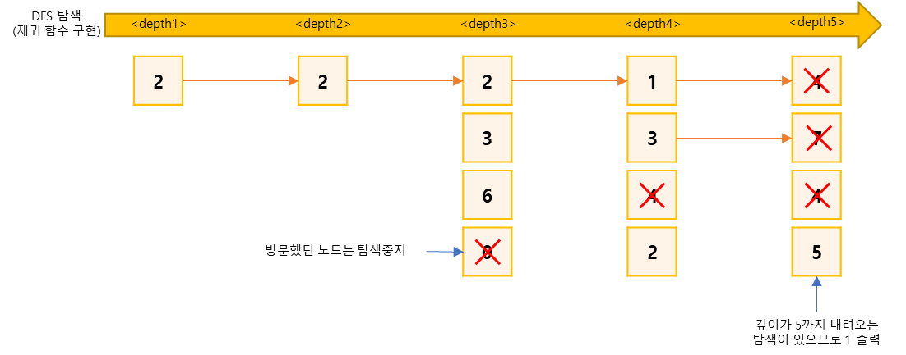

## 친구 관계 파악하기
https://www.acmicpc.net/problem/13023

-----
BOJ 알고리즘 캠프에는 총 N명이 참가하고 있다. 사람들은 0번부터 N-1번으로 번호가 매겨져 있고, 일부 사람들은 친구이다.

오늘은 다음과 같은 친구 관계를 가진 사람 A, B, C, D, E가 존재하는지 구해보려고 한다.

- A는 B와 친구다.
- B는 C와 친구다.
- C는 D와 친구다.
- D는 E와 친구다.

위와 같은 친구 관계가 존재하는지 안하는지 구하는 프로그램을 작성

-----
#### 입력
- 1번째 줄에 사람의 수 N (5 ≦ N ≦ 2000)과 친구 관계의 수 M (1 ≦ M ≦ 2000)
- 2번째 줄에 M개의 줄에는 정수 a와 b가 주어지며, a와 b가 친구라는 뜻이다. (0 ≦ a, b ≦ N-1, a ≠ b) 같은 친구 관계가 두 번 이상 주어지는 경우는 없다.

#### 출력
- 문제의 조건에 맞는 A, B, C, D, E가 존재하면 1을 없으면 0을 출력

##### 예제
| 예제 번호 | 예제 입력                                                                       | 예제 출력 |
|:------|:----------------------------------------------------------------------------|-------|
| 1     | 8 8 <br> 1 7 <br> 3 7 <br> 4 7 <br> 3 4 <br> 4 6 <br> 3 5 <br> 0 4 <br> 2 7 | 1     |
| 2     | 5 5 <br> 0 1 <br> 1 2 <br> 2 3 <br> 3 0 <br> 1 4                            | 1     |


-----
### 슈도 코드
  ```
N(노드 개수) M(에지 개수)
A(그래프 데이터 저장 인접 리스트)
visited(방문 기족 저장 배열)
arribe(도착 확인 변수)
for(N의 개수만큼 반복){
    A 인접 리스트의 각 ArrayList 초기화 하기
}
for(M의 개수만큼 반복하기){
    A 인접 리스트에 그래프 데이터 저장하기
}
for(N의 개수만큼 반복하기){
   각 노드마다 DFS 실행하기
   if(arrive) 반복문 종료 //depth가 5에 도달한 적이 있다면
}
if(arrive) 1출력
else 0 출력

// DFS 구현하기
DFS {
    if(깊이가 5 || arrive){
        arrive = true;
        함수 종료
    }
    방문 배열에 현재 노드 방문 기록하기
    현재 노드의 연결 노드중 방문하지 않은 노드로 DFS실행하기(호출마다 depth는 1씩 증가)
}

  ```
-----
### 중요한 점
- N의 최대 범위가 2,000이므로 알고리즘의 시간 복잡도를 고려할 필요 있음.
- 문제에서 요구하는 A, B, C, D의 관계는 재귀 함수의 형태와 비슷하며, 주어진 모든 노드에  
DFS를 수행하며 재귀의 깊이가 5이상이면 1, 아니라면0을 출력
- DFS의 시간 복잡도 O(V + E)이므로 최대 4,000 모든 노드를 진행했을 때 4000*2000 즉 8,000,000이므로  
 DFS를 사용해도 제한 시간내에 가능  

1. 그래프 데이터를 인접 리스트로 저장  

2. 모든 노드에서 DFS를 수행합니다. 수행할 때 재귀 호출마다 깊이를 더합니다. 깊이가 5가 되면 1을 출력하고 프로그램 종료  

3. 모든 노드를 돌아도 1이 출력되지 않았다면 0을 출력