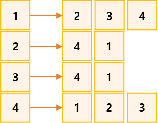
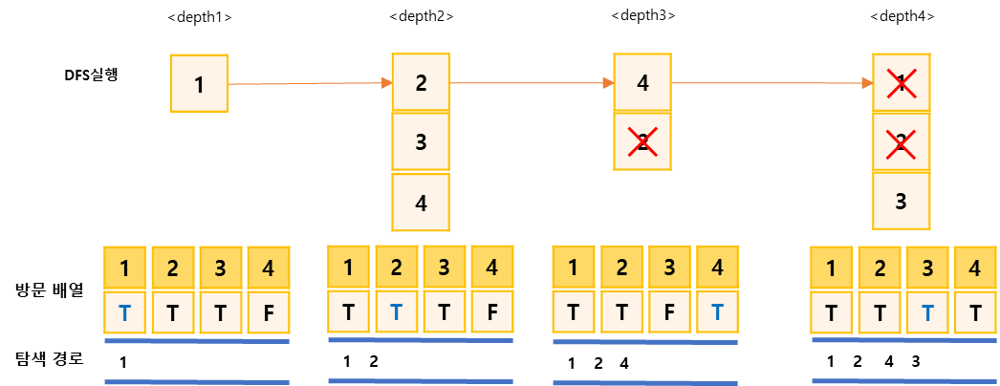
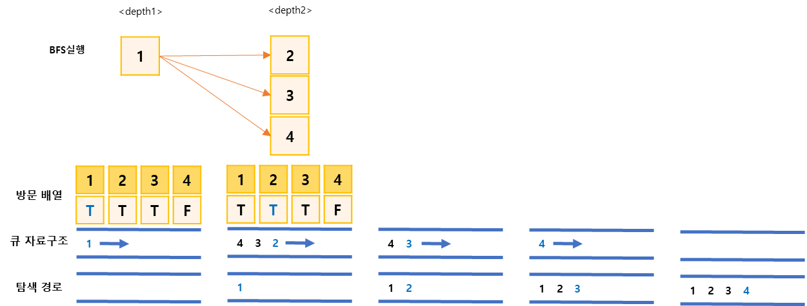

## DFS와 BFS프로그램
https://www.acmicpc.net/problem/1260

-----
그래프를 DFS로 탐색한 결과와 BFS로 탐색한 결과를 출력하는 프로그램을 작성하시오.  
단, 방문할 수 있는 정점이 여러 개인 경우에는 정점 번호가 작은 것을 먼저 방문하고,  
더 이상 방문할 수 있는 점이 없는 경우 종료한다. 정점 번호는 1번부터 N번까지이다.

-----
#### 입력
- 1번째 줄에 정점의 개수 N(1 ≦ N ≦ 1,000), 간선의 개수 M(1 ≦ M ≦ 10,000), 탐색을 시작할 정점의 번호 V가 주어진다.
- 다음 M개의 줄에는 간선이 연결하는 두 정점의 번호가 주어진다. 어떤 두 정점 사이에 여러 개의 간선이 있을 수 있다. 입력으로 주어지는 간선은 양방향이다.

#### 출력
- 1번째 줄에 DFS를 수행한 결과를, 그 다음 줄에는 BFS를 수행한 결과를 출력한다. V부터 방문된 점을 순서대로 출력하면 된다.

##### 예제
| 예제 번호 | 예제 입력                                                                 | 예제 출력                    |
|:------|:----------------------------------------------------------------------|--------------------------|
| 1     | 8 8 1 // 노드개수, 에지 개수, 시작점<br> 1 2 <br> 1 2 <br> 1 4 <br> 2 4 <br> 3 4 | 1 2 4 3 <br> 1 2 3 4     |
| 2     | 5 5 3<br> 5 4 <br> 5 2 <br> 1 2 <br> 3 4 <br> 3 1                     | 3 1 2 5 4 <br> 3 1 4 2 5 |


-----
### 슈도 코드
  ```
N(노드 개수) M(에지 개수) Start(시작점)
A(그래프 데이터 저장 인접 리스트) visited(방문 기록 저장 배열)
for(N의 개수만큼 반복하기){
    A 인접 리스트의 각 ArrayList 초기화 하기
}
for(M의 개수만큼 반복하기) {
    A 인접 리스트에 그래프 데이터 정렬하기
}
// 방문할 수 있는 노드가 여러 개일 경우에는 번호가 작은 것을 먼저 방문하기 위해 정렬하기
for(N의 개수만큼 반복하기){
    각 노드와 관련된 에지를 정렬하기
}
visited 배열 초기화 하기
DFS(Start) 실행하기
visited 배열 초기화하기
BFS(Start) 실행하기

DFS{
    현재 노드 출력하기
    visited 배열에 현재 노드 방문 기록하기
    현재 노드의 연결 노드 중 방문하지 않은 노드로 DFS실행하기(재귀 함수 형태)
}
BFS{
    큐 자료구조에 시작 노드 삽입하기(add연산)
    visited 배열에 현재 노드 방문 기록하기
    while(큐가 비어 있을 때까지){
        큐에서 노드 데이터를 가져오기(poll 연산)
        가져온 노드 출력하기
        현재 노드의 연결 노드 중 미방문 노드를 큐에 삽입(add 연산)하고 방문 배열에 기록하기
    }
}

  ```
-----
### 중요한 점
- DFS와 BFS를 물어보는 기본문제
1. 인접 리스트에 그래프를 저장합니다.  

2. DFS를 실행하면서 방문 배열 체크와 탐색 노드 기록을 수행합니다. 문제 조건에서 작은 번호의 노드부터  
탐색한다고 했으므로 인접 노드를 오름차순으로 정렬한 후 재구 힘수를 호출합니다.  

3. BFS도 같은 방식으로 진행합니다. 노드를 오름차순을 정렬하여 큐에 삽입합니다.  

4. DFS와 BFS를 마쳤다면 각각 탐색하여 기록한 데이터를 출력