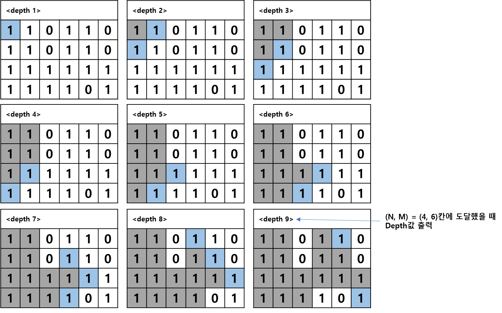

## 미로 탐색하기
https://www.acmicpc.net/problem/2178

-----
N×M크기의 배열로 표현되는 미로가 있다.
<table class="tg">
<thead>
  <tr>
    <th class="tg-0lax">1</th>
    <th class="tg-0lax">0</th>
    <th class="tg-0lax">1</th>
    <th class="tg-0lax">1</th>
    <th class="tg-0lax">1</th>
    <th class="tg-0lax">1</th>
  </tr>
</thead>
<tbody>
  <tr>
    <td class="tg-0lax">1</td>
    <td class="tg-0lax">0</td>
    <td class="tg-0lax">1</td>
    <td class="tg-0lax">0</td>
    <td class="tg-0lax">1</td>
    <td class="tg-0lax">0</td>
  </tr>
  <tr>
    <td class="tg-0lax">1</td>
    <td class="tg-0lax">0</td>
    <td class="tg-0lax">1</td>
    <td class="tg-0lax">0</td>
    <td class="tg-0lax">1</td>
    <td class="tg-0lax">1</td>
  </tr>
  <tr>
    <td class="tg-0lax">1</td>
    <td class="tg-0lax">1</td>
    <td class="tg-0lax">1</td>
    <td class="tg-0lax">0</td>
    <td class="tg-0lax">1</td>
    <td class="tg-0lax">1</td>
  </tr>
</tbody>
</table>

미로에서 1은 이동할 수 있는 칸을 나타내고, 0은 이동할 수 없는 칸을 나타낸다. 이러한 미로가 주어졌을 때, (1, 1)에서 출발하여 (N, M)의 위치로 이동할 때 지나야 하는 최소의 칸 수를 구하는 프로그램을 작성하시오. 한 칸에서 다른 칸으로 이동할 때, 서로 인접한 칸으로만 이동할 수 있다.

위의 예에서는 15칸을 지나야 (N, M)의 위치로 이동할 수 있다. 칸을 셀 때에는 시작 위치와 도착 위치도 포함한다.

-----
#### 입력
- 1번째 줄에 두 정수 N, M(2 ≦ N, M ≦ 100)이 주어진다. 
- 다음 N개의 줄에는 M개의 정수로 미로가 주어진다. 각각의 수들은 붙어서 입력으로 주어진다. 

#### 출력
- 1번째 줄에 지나야 하는 최소의 칸 수를 출력한다. 항상 도착위치로 이동할 수 있는 경우만 입력으로 주어진다.

##### 예제
| 예제 번호 | 예제 입력                                                              | 예제 출력 |
|:------|:-------------------------------------------------------------------|-------|
| 1     | 4 6 // N, M<br> 101111 <br> 101010 <br> 101011 <br> 111011         | 15    |
| 2     | 4 6 <br> 110110 <br> 110110 <br> 111111 <br> 111101                | 9     |
| 3     | 2 25 <br> 1011101110111011101110111 <br> 1110111011101110111011101 | 38    |

-----
### 슈도 코드
  ```
dx, dy(상하좌우를 탐색하기 위한 define값 정의 변수)
A(데이터 저장 2차원 행렬)
N(row), M(column)
visited(방문 기록 저장 배열)
A 배열 초기화 하기
visited 배열 초기화하기
for(N의 개수만큼 반복){
    for(M의 개수만큼 반복){
        A배열에 데이터 저장하기
    }
}
BFS(0, 0) 실행하기
BFS{
   큐 자료구조에 시작 노드 삽입하기(add연산)
   visited 배열에 현재 노드 방문 기록하기
   while(큐가 비어 있을 때까지){
       큐에서 노드 데이터를 가져오기(poll 연산)
       for(상하좌우 탐색) {
           if(유효한 좌표){
               if(이동할 수 있는 칸이면서 방문하지 않은 노드) {
                   visited 배열에 방문 기록하기
                   A 배열에 depth를 현재 노드의 depth + 1로 업데이트하기
                   큐에 데이터 삽입하기(add 연산)
               }
           }
       }
   }
}
  ```
-----
### 중요한 점
- N, M의 최대 데이터의 크기가 100으로 작아서 시간 제한은 크게 없다.
- 해당 문제의 요구사항은 지나야 하는 칸 수의 최솟값을 찾는 것
- 완전 탐색을 진행하며 몇 번째 깊이에서 원하는 값을 찾을 수 있는지를 구하는 것과 동일
- 따라서 BFS를 사용하여 최초로 도달했을 때 깊이를 출력하면 문제 해결 가능
- DFS보다 BFS가 적합한 이유는 BFS는 해당 깊이에서 갈 수 있는 노드 탐색을 마친 후 다음 깊이로 넘어가기 때문
1. 2번예제로 풀이
2. 2차원 배열에 데이터를 저장한 다음(1, 1)에서 BFS를 실행
3. 상, 하, 좌, 우 네 방향을 보며 인접한 칸을 봅니다. 인접한 칸의 숫자가 1이면서 아직 방문하지 않았다면 큐에 삽입
4. 종료지점 (N, M)에서 BFS를 종료하며 깊이를 출력

5. (1, 1)에서 출발해 상, 하, 좌, 우 순서로 노드를 큐에 삽입하며 방문 배열에 체크하면서 노드를 큐에 삽입하면서 체크
6. 노드 방문하면 깊이 9단계에서 (4, 6)에 도달.