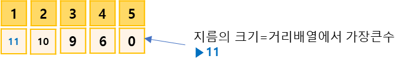

## 트리의 지름 구하기
https://www.acmicpc.net/problem/1167

-----
트리의 지름이란, 트리에서 임의의 두 점 사이의 거리 중 가장 긴 것을 말한다. 트리의 지름을 구하는 프로그램을 작성

-----
#### 입력
- 트리가 입력으로 주어진다.
- 1번째 줄에서는 트리의 정점의 개수 V가 주어지고 (2 ≦ V ≦ 100,000)
- 둘째 줄부터 V개의 줄에 걸쳐 간선의 정보가 다음과 같이 주어진다. 정점 번호는 1부터 V까지  
매겨져 있다.
- 먼저 정점 번호가 주어지고, 이어서 연결된 간선의 정보를 의미하는 정수가 두 개씩 주어지는데,  
하나는 정점번호, 다른 하나는 그 정점까지의 거리이다. 
<br><br>
- 예를 들어 네 번째 줄의 경우 정점 3은 정점 1과 거리가 2인 간선으로 연결되어 있고,  
- 정점 4와는 거리가 3인 간선으로 연결되어 있는 것을 보여준다. 
- 각 줄의 마지막에는 -1이 입력으로 주어진다. 주어지는 거리는 모두 10,000 이하의 자연수이다.

#### 출력
- 첫째 줄에 트리의 지름을 출력

##### 예제
| 예제 번호 | 예제 입력                                                                                | 예제 출력 |
|:------|:-------------------------------------------------------------------------------------|-------|
| 1     | 5 <br> 1 3 2 -1 <br> 2 4 4 -1  <br> 3 1 2 4 3 -1 <br> 4 2 4 3 3 5 6 -1 <br> 5 4 6 -1 | 11    |


-----
### 슈도 코드
  ```
N(노드 개수) A(그래프 데이터 저장 인접 리스트) // ArrayList<Edge>[] 형태로 선언하기
visited(방문 기록 저장 배열) distance(거리 저장 배열)
for(N의 개수만큼 반복하기) {
    A 인접 리스트의 각 ArrayList 초기화하기
}
for(M의 개수만큼 반복하기){
    A 인접 리스트에 그래프 데이터 저장하기
}
visited 배열 초기화 하기
distance 배열 초기화 하기
BFS(임의의 점을 시작점으로) 실행하기
distance 배열에서 가장 큰 수를 정답으로 출력하기
BFS {
    큐 자료구조에 시작 노드 삽입하기(add 연산)
    visited 배열에 현재 노드 방문 기록하기
    while(큐가 비어 있을 때까지){
        큐에서 노드 데이터를 가져오기(poll 연산)
        가져온 노드 출력하기
        현재 노드의 연결 노드 중 방문하지 않으 노드로
        큐에 데이터 삽입(add 연산)하고 visited 배열에 방문 기록하기
        그리고 현재 노드의 거리 + 에지의 가중치로 방문하지 않은 노드 거리 배열 업데이트하기
    }
}
Edge {// 에지 클래스 별도 구현하기
    e(목적지 노드), value(에지의 가중치)
}

  ```
-----
### 중요한 점
- 가장 긴 경로를 찾는 방법과 관련된 아이디어가 필요한 문제.  
- 가장 긴 경로 찾기 아이디어  
  `아이디어 1 : 임의의 노드에서 가장 긴 경로로 연결되 있는 노드는 트리의 지금에 해당하는 두 노드 중 하나다.`
1. 그래프를 인접 리스트로 저장. 아래의 그림처럼 (노드, 가중치)를 표현하기 위해 노드를 클래스로 선언

2. 임의의 노드에서 BFS를 수행하고 탐색할 때 각 노드의 거리르 배열에 저장합니다.  여기에 서는 임의의 노드 중 노드 2에서 탐색을 시작하는 경우를 살펴보겠습니다.

3. 과정 2에서 얻은 배열에서 임의의 노드와 가장 먼 노드를 찾습니다. 그런 다음 그 노드부터 BFS를  
다시 수행합니다. 이와 마찬가지로 탐색할 때 각 노드의 거리를 배열에 저장합니다.

4. 과정 3에서 배열에 저장한 값 중 가장 큰 값을 이트리의 지름으로 출력합니다.
