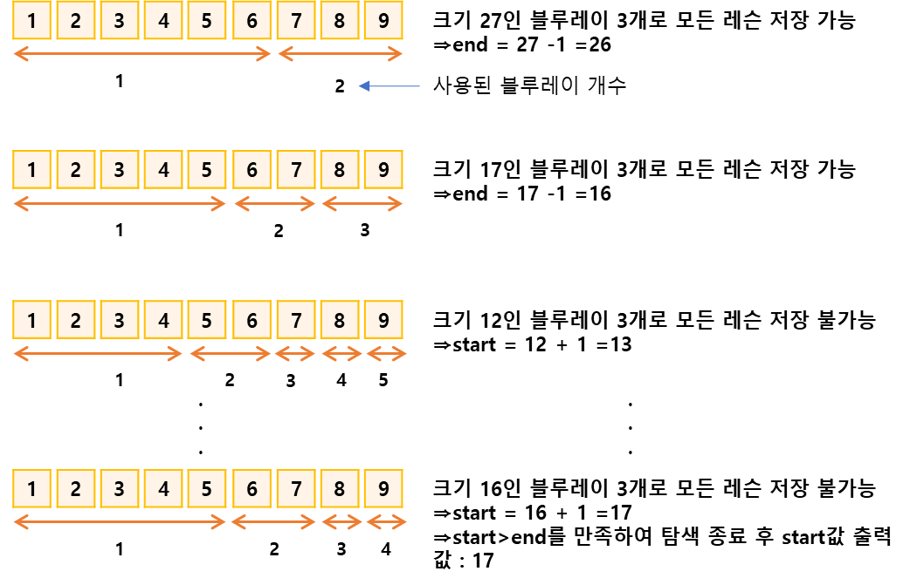

## 블루레이만들기
https://www.acmicpc.net/problem/2343

-----
블루레이에는 총 N개의 강의가 들어가는데, 블루레이를 녹화할 때, 강의의 순서가 바뀌면 안 된다.  
순서가 뒤바뀌는 경우에는 강의의 흐름이 끊겨, 학생들이 대혼란에 빠질 수 있기 때문이다.  
즉, i번 강의와 j번 강의를 같은 블루레이에 녹화하려면 i와 j 사이의 모든 강의도 같은 블루레이에  
녹화해야 한다.

이 블루레이가 얼마나 팔릴지 아직 알 수 없기 때문에, 블루레이의 개수를 가급적 줄이려고 한다.  
오랜 고민 끝에 강토는 M개의 블루레이에 모든 기타 강의 동영상을 녹화하기로 했다.  
이때, 블루레이의 크기(녹화 가능한 길이)를 최소로 하려고 한다.  
단, M개의 블루레이는 모두 같은 크기이어야 한다.  
강토의 각 강의의 길이가 분 단위(자연수)로 주어진다. 이때, 가능한 블루레이의 크기 중 최소를  
구하는 프로그램을 작성

-----
#### 입력
- 1번째 줄에 강의의 수 N (1 ≦ N ≦ 100,000)과 M (1 ≦ M ≦ N)이 주어진다.
- 다음 줄에는 강토의 기타 강의의 길이가 강의 순서대로 분 단위로(자연수)로 주어진다.
- 각 강의의 길이는 10,000분을 넘지 않는다.

#### 출력
- 1번째 줄에 가능한 블루레이 크기중 최소를 출력

##### 예제
| 예제 번호 | 예제 입력                                       | 예제 출력 |
|:------|:--------------------------------------------|-------|
| 1     | 9 3 // 레슨 수, 블루레이 개수 <br> 1 2 3 4 5 6 7 8 9 | 17    |


-----
### 슈도 코드
  ```
N(레슨 개수) M(블루레이 개수)
A(정렬할 배열 선언하기)
for(N의 개수만큼 반복){
    A배열 저장하기
    시작 인덱스 저장(A 배열 중 최댓값)
    종료 인덱스 저장(A 배열의 총합)
}
start(시작 인덱스), end(종료인덱스)
while(시작 인덱스 <= 종료 인덱스) {
    middle(중간 인덱스)
    sum(레슨 합)
    count(현재 사용한 블루레이 개수)
    for(N의 개수만큼 반복하기){
        만약 sum + 현재 레슨 시간 > 중간 인덱스이면
        count값을 올리고 sum을 0으로 리셋하기
        // 현재 블루레이에 저장할 수 없어 새로운 블루레이도 교체한다는 의미
        sum에 현재 레슨 시간값 더하기
    }
    sum이 0이 아니면 마지막 블루레이가 필요하므로 count값 올리기
    if(count > M: 중간 인덱스값으로 모든 레슨 저장 불가능) 시작인덱스 = 중앙 인덱스 + 1
    else(중간 인덱스값으로 모든 레슨 저장 가능) 종료 인덱스 = 중앙 인덱스 -1
}
시작 인덱스 출력하기
  ```
-----
### 중요한 점
- 블루레이의 크기가 모두 같고 녹화순서가 바꾸지 않아야 함이라는 조건이 이진탐색 알고리즘을 선택하는  
실마리 블루레이에 첫 레슨부터 마지막 레슨까지 차례대로 저장하다보면 지정한 블루레이의 크기로 모든   
레슨을 저장할 수 있는지를 판단할 수 있기 때문입니다. 모두 저장할 수 있다면 블루레이 크기를 줄이고  
저장할 수 없다면 블루레이 크기를 늘리는 방식으로 블루레이 크기의 최솟값을 알 수 있습니다.

1. 이진 탐색의 시작 인덱스는 **최대 길이의 레슨**이고 종료 인덱스는 **모든 레슨의 길이의 합**입니다  
총 9개로 구성된 레슨의 시작은 각각 1, 2, 3, 4, 5, 6, 7, 8, 9이므로 이진 탐색의 시작인덱스는 최대  
레슨 시간인 9, 종료 인덱스는 레슨 시간을 모두 합한 45입니다. 블루레이 개수가 3일 때 9~45사이에서  
블루레이 크기의 최솟값을 이진탐색으로 찾으면 됩니다.
2. 9~45 사이에서 이진 탐색을 다음과 같이 수행합니다. 이진 탐색은 시작 인덱스 > 종료 인덱스일  
때까지 수행합니다  
`이진 탐색 수행`
   - 중앙값 크기로 모든 레슨을 저장할 수 있으면 종료 인덱스 = 중앙값 -1 // 왼쪽 데이터셋
   - 중앙값 크기로 모든 레슨을 저장할 수 없으면 시작 인덱스 = 중앙값 +1 // 오른쪽 데이터셋
