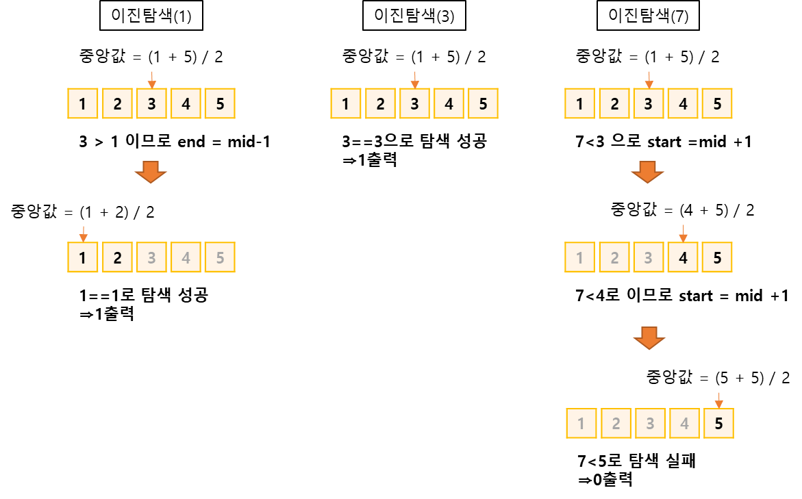
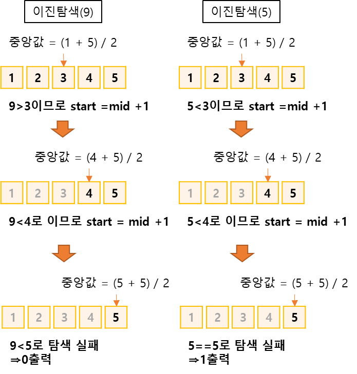

## 원하는 정수 찾기
https://www.acmicpc.net/problem/1920

-----
N개의 정수 A[1], A[2], …, A[N]이 주어져 있을 때, 이 안에 X라는 정수가 존재하는지 알아내는  
프로그램을 작성

-----
#### 입력
- 1번째 줄에 자연수 N(1 ≦ N ≦ 100,000)이 주어진다. 
- 다음 줄에는 N개의 정수 A[1], A[2], …, A[N]이 주어진다.
- 다음 줄에는 M개의 수들이 주어지는데, 이 수들이 A안에 존재하는지 알아내면 된다. 
- 모든 정수의 범위는  보다 크거나 같고 보다 작다.

#### 출력
- M개의 줄에 답을 출력한다. 존재하면 1을, 존재하지 않으면 0을 출력

##### 예제
| 예제 번호 | 예제 입력                                                           | 예제 출력                         |
|:------|:----------------------------------------------------------------|-------------------------------|
| 1     | 5 // 데이터 개수 <br> 4 1 5 2 3 <br> 5 // 찾아야 할 숫자 개수 <br> 1 3 7 9 5 | 1 <br> 1 <br> 0 <br> 0 <br> 1 |


-----
### 슈도 코드
  ```
N(정렬할 수 개수) M(탐색할 숫자의 개수)
A(정렬할 배열 선언하기)
for(N의 개수만큼 반복하기){
    A배열 저장하기
}
A배열 정렬하기
for(M의 개수만큼 반복하기){
    target(찾아야 하는 수)
    // 이진 탐색 시작
    start(시작 인덱스), end(종료 인덱스)
        while(시작인덱스 <= 종료 인덱스){
            midi(중간 인덱스)
            if(중앙값 > target){
                종료 인덱스 = 중간 인덱스 -1
            }
            else if(중앙값 < target) {
                시작 인덱스 = 중간 인덱스 +1
            } else {
                찾았으므로 반복문 종료하기
            }
        }
    if(찾았음) 1 출력
    else 0 출력
}
  ```
-----
### 중요한 점
- N의 최대 범위가 100,000이므로 단순 반복문으로는 문제를 풀수 없다.
- 이진 탐색을 적용하면O(nlonn) 시간 복잡도로 해결할 수 있으므로 이진탐색을 이용

1. 탐색 데이터를 1차원 배열에 저장한 다음 저장된 배열을 정렬

2. X라는 정수가 존재하는지 이진 탐색을 사용해 확인



## 이진 탐색(binary search)
- 데이터가 정렬돼 있는 상태에서 원하는 값을 찾아내는 알고리즘
- 대상 데이터의 중앙값과 찾고자 하는 값을 비교해 데이터의 크기를 절반씩 줄이면서 대상을 찾아감

| 기능        | 특징                  | 시간 복잡도  |
|:----------|:--------------------|---------|
| 타깃 데이터 탐색 | 중앙값 비교를 통한 대상 축소 방식 | O(logN) |

`이진 탐색 과정 `
1. 현재 데이터셋의 중앙값(median)을 선택한다.
2. 중앙값 > 타깃 데이터(target data)일 때 중앙값 기준으로 왼쪽 데이터셋을 선택
3. 중앙값 < 타깃 데이터일 때 중앙값 기준으로 오른쪽 데이터셋을 선택
4. 과정 1~3을 반복하면서, 중앙값==타깃 데이터일 때 탐색 종료