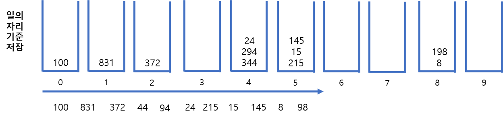
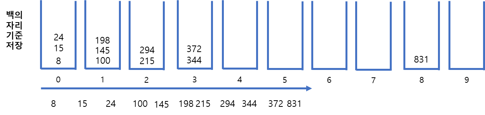

## 수 정렬하기3 (기수 정렬)

https://www.acmicpc.net/problem/10989

-----
N개의 수가 주어졌을 때, 이를 오름차순으로 정렬하는 프로그램을 작성

-----
#### 입력
- 1번째 줄에 수의 개수 N(1 ≦ N ≦ 10,000,000)이 주어진다. 둘째 줄부터 N개의 줄에는 수가 주어진다. 이 수는 10,000보다 작거나 같은 자연수이다.
#### 출력
- 첫째 줄부터 N개의 줄에 오름차순으로 정렬한 결과를 한 줄에 하나씩 출력한다.

##### 예제
| 예제 번호 | 예제 입력                                                                                           | 예제 출력                                                                           |
|:------|:------------------------------------------------------------------------------------------------|---------------------------------------------------------------------------------|
| 1     | 11// 수의 개수 <br>215 <br>15 <br>344 <br>372 <br>294 <br>100 <br>8 <br>145 <br>24 <br>298 <br>831  | 8 <br>15 <br>24 <br>100 <br>145 <br>198 <br>215 <br>294 <br>344 <br>372 <br>831 |


-----
### 슈도 코드
  ```
N(정렬할 수 개수)
A(정렬할 배열 선언하기)
for(N의 개수만큼 반복하기){
    A 배열 저장하기
}
기수 정렬 함수 수행하기
정렬된 A배열 출력하기

// 기수 정렬 함수 구현하기
// 변수 선언부
bucket(현재 자릿수들의 문포를 합 배열의 형태로 알려주는 배열)
ex: bucket[4] → 현재 기분 자릿갑이 0~4까지 몇개의 데이터가 있는지 저장하기
output(임시 정렬을 위한 배열)
jarisu(현재 자릿수를 표현하는 수)
// 로직 부분
while(최대 자릿수만큼 반복하기){
    현재 기분 자릿수를 기준으로 A배열 데이터를 bucket에 count
    합 배열 공직으로 bucket을 합 배열 형태로 변경하기
    for(N의 개수만큼 반복하기){
        bucket값을 이용행 현재 기준 자릿수로 데이터를 정렬하기
        output 배열에 저장하기
    }
    for(N의 개수만큼 반복하기){
        다음 자릿수 이동을 위해 A배열에 output 데이터 저장하기
    }
    jarisu = jarisu * 10
}
  ```
-----
### 중요한 점
- 이 문제는 N의 최대 개수가 10,000,000으로 매우 크기 때문에 O(nlogn)보다 더 빠른 알고리즘이 필요
- 10,000보다 작다는 것을 바탕으로 O(kn)의 시간 복잡도의 기수 정렬을 사용하면된다.
- 자릿수가 서로 다른 경우 자릿수가 적은 수 앞에 0이 채워져 있다고 생각하여 큐에 삽입하면 됩니다.
- 아래의 그림을 봅니다. 최초에는 일의 자릿수를 기준으로 큐에 삽입합니다. 100은 0번째에, 831번은 1번째 큐에 삽입합니다. 이후 큐에서 순서대로 pop한 결과는 100, 831, 372, 344, 294, 24, 215, 15, 145, 8, 198입니다.

- 이어서 십의 자릿수를 기준으로 큐에 삽입하고 정렬합니다. 이때 8과 같은 수는 008이라고 생각하여 0위치의 큐에 삽입합니다.

- 백의 자릿수 기준도 마찬가지 과정을 진행 합니다.

- 최종결과는 8, 15, 24, 100, 145, 198, 215, 294, 344, 372, 831입니다.
- 일반적인 기수 정렬은 우선순위 큐를 사용해 비교적으로 간단하게 구하는 방법이 있지만 시간복잡도를 느리게 하는 요소가 있으므로 위 코드와 같이 구간 합을 이용하는 방법으로 구현