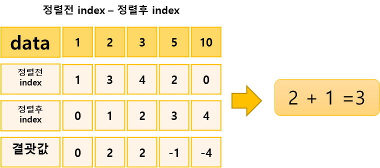

## 버블 소트 프로그램1

https://www.acmicpc.net/problem/1377

-----
버블 소트 알고리즘을 다음과 같이 C++로 작성했다.
  ```
bool changed = false;
for (int i=1; i<=N+1; i++) {
    changed = false;
    for (int j=1; j<=N-i; j++) {
        if (A[j] > A[j+1]) {
            changed = true;
            swap(A[j], A[j+1]);
        }
    }
    if (changed == false) {
        cout << i << '\n';
        break;
    }
}
  ```
위 소스에서 N은 배열의 크기이고, A는 정렬해야 하는 배열이다. 배열은 A[1]부터 사용한다.

위와 같은 소스를 실행시켰을 때, 어떤 값이 출력되는지 구해보자.

-----
#### 입력
- 첫째 줄에 N이 주어진다. N은 500,000보다 작거나 같은 자연수이다. 
- 둘째 줄부터 N개의 줄에 A[1]부터 A[N]까지 하나씩 주어진다. A에 들어있는 수는 1,000,000보다 작거나 같은 자연수 또는 0이다.

#### 출력
정답을 출력한다.

##### 예제
| 예제 번호 | 예제 입력                                         | 예제 출력 |
|:------|:----------------------------------------------|-------|
| 1     | 5// 배열의 크기 <br> 10<br> 1 <br> 5 <br> 2 <br> 3 | 3     |


-----
### 슈도 코드
  ```
N(데이터 개수) A(데이터 배열, 단 클래스를 데이터로 담는 배열)
for(N만큼 반복하기){
    A 배열 저장하기
}
A배열 정렬하기
for(N만큼 반복하기){
    A[i]의 정렬전 index - 정렬후 index 계산의 최댓값을 찾아 저장하기
}
최댓값 + 1을 정답으로 출력하기

별도 클래스 선언
mData(데이터 표현){
    index, value를 가지며
    value 기준 오름차순 정렬함수 Comparable 구현
}
  ```
-----
### 중요한 점
- 버블 정렬의 swap이 한 번도 일어나지 않은루프가 언제인지 알아 내는 문제
- '버블 정렬의 이중 for문에서 안쪽 for문 전체를 돌 때 swap이 일어나지 않았음'는 이미 모든 데이터가 정렬되었다는 것을 의미
- 하지만 이 문제는 N의 최대 범위가 500,000이므로 버블 정렬로 문제를 풀면 시간초과  
- 안쪽 for문이 몇 번 수행됐는지 구하는 다른 아이디어  
  `안쪽 루프는 1에서 n-1까지, 즉 왼쪽에서 오른쪽으로 이동하면서 swap을 수행한다. 이는 특정 데이터가 안쪽 루프에서 swap의 왼쪽으로 이동할 수 있는 최대 거리가 1이라는 똣이다. 즉, 데이터의 정렬 전 index와 정렬후 index를 비교해 왼쪽으로 가장 많이 이동한 값을 찾으면 이문제를 해결할 수 있다.  `  
  `1. 자바에서 기본적으로 제공하는 sort()함수로 배열을 정렬합니다. sort()함수의 시간 복잡도는 O(nlogn)입니다.`  
  `2. 각 데이터마다 정렬 전 index값에서 정렬 후 index값을 빼고 최댓값을 찾습니다. 그리고 swap이 일어나지 않는 반복분이 한 번 더 실행되는 것을 감안해 최댓값에 1을 더합니다.`  
 