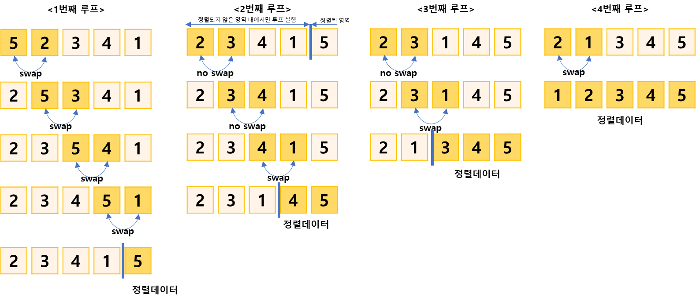

## 수 정렬하기1

https://www.acmicpc.net/problem/2750

-----
N개의 수가 주어졌을 때 이를 오름차순 정렬하는 프로그램

-----
#### 입력
- 첫째 줄에 수의 개수 N(1 ≦ N ≦ 1,000)이 주어진다.  
- 둘째 줄부터 N개의 줄에는 수 주어진다. 이 수는 절댓값이 1,000보다 작거나 같은 정수이다. 수는 중복되지 않는다.

#### 출력
첫째 줄부터 N개의 줄에 오름차순으로 정렬한 결과를 한 줄에 하나씩 출력한다.

##### 예제
| 예제 번호 | 예제 입력                                       | 예제 출력                          |
|:------|:--------------------------------------------|--------------------------------|
| 1     | 5// 수의 개수 <br> 5<br> 2 <br> 3 <br> 4 <br> 1 | 1 <br> 2 <br> 3 <br> 4 <br> 5  |


-----
### 슈도 코드
  ```
N(정렬할 수 개수)
A(정렬할 배열 선언)
for(i정렬할 수의 갯수-1 만큼){
    for(j정렬할 수 개수 -1 -i){
        현재 A의 배열의 값보다 1칸 오른 쪽 배열의 값이 더 작으면 두수 바꾸기
    }
}
A배열 출력
  ```
-----
### 중요한 점
- 자바에서는 sort()함수를 이용하여 정렬가능
- N의 최대 범위가 1,000으로 매우 작기 때문에 O()시간 복잡도로 알고리즘을 해결가능

1. 비교 연산이 필요한 루프 범위를 설정
2. 인접한 데이터의 값을 비교한다.
3. swap 조건이 부합하면 swap연산을 수행한다.
4. 루프 범위가 끝날 때까지 반복
5. 정렬 영역을 설정합니다. 다음 루프를 실행할 때는 이영역을 제외한다.
6. 비교 대상이 없을 때까지 반복한다.