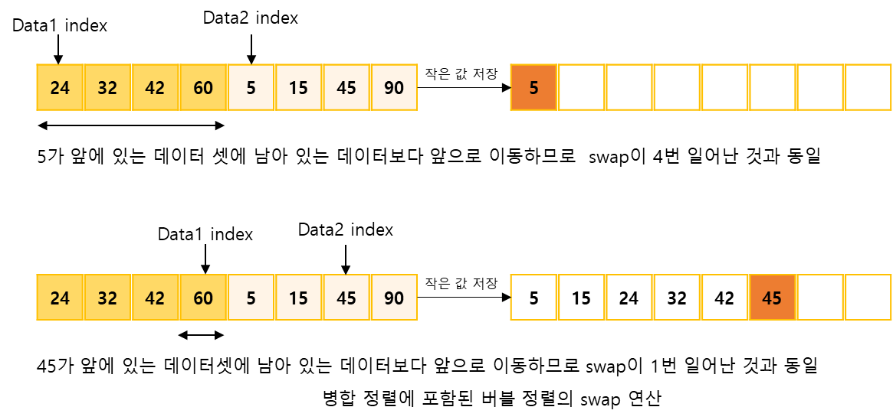
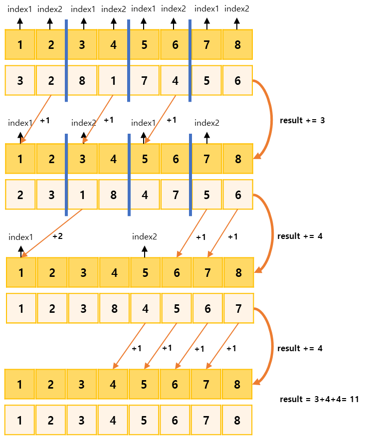

## 버블 소트 프로그램2

https://www.acmicpc.net/problem/1517

-----
N개의 수로 이루어진 수열 A[1], A[2], …, A[N]이 있다. 이 수열에 대해서 버블 소트를 수행할 때, Swap이 총 몇 번 발생하는지 알아내는 프로그램을 작성  
버블 소트는 서로 인접해 있는 두 수를 바꿔가며 정렬하는 방법이다. 예를 들어 수열이 3 2 1 이었다고 하자. 이 경우에는 인접해 있는 3, 2가 바뀌어야 하므로 2 3 1 이 된다. 다음으로는 3, 1이 바뀌어야 하므로 2 1 3 이 된다. 다음에는 2, 1이 바뀌어야 하므로 1 2 3 이 된다. 그러면 더 이상 바꿔야 할 경우가 없으므로 정렬이 완료된다.

-----
#### 입력
- 1번째 줄에 N(1 ≦ N ≦ 500,000)이 주어진다. 다음 줄에는 N개의 정수로 A[1], A[2], …, A[N]이 주어진다. 각각의 A[i]는 0 ≦ |A[i]| ≦ 1,000,000,000의 범위에 들어있다.

#### 출력
- 1번째 줄에 swap 횟수를 출력한다.

##### 예제
| 예제 번호 | 예제 입력                                                     | 예제 출력 |
|:------|:----------------------------------------------------------|-------|
| 1     | 8// 수의 개수 <br>3 <br>2 <br>8 <br>1 <br>7 <br>4 <br>5 <br>6 | 11    |


-----
### 슈도 코드
  ```
N(정렬할 수 개수)
A(정렬할 배열 선언하기)
tmp(정렬할 때 잠시 사용할 임시 배열 선언하기)
for(N의 개수만큼){
    A배열 선언하기
}
병합 정렬 함수 수행하기
결괏값 출력하기
// 병합 정렬 수행하기
병합정렬(s, e) {
    s(시작점), e(종료점),m(중간점)
    // 재귀 형태로 구현하기
    병합 정렬(s, m)
    병합 정렬(m + 1, e)
    for(s ~ e){
        tmp 배열 저장하기
    }
    // 두 그룹을 병합하는 로직
    index1  → 앞쪽 그룹 시작점
    index2  → 뒷쪽 그룹 시작점
    while(index1 <= 중간점 && index2 <= 종료점) {
        뒤쪽 데이터 값이 더 작아 선택될 때
        swap이 일어났다고 가정하고, 현재 남아 있는 데이터 개수만큼 결괏값을 더함
    }
    반복문의 끝난 후 남아 있는 데이터 정리하기
}
  ```
-----
### 중요한 점
- N의 최대 범위가 1,000,000이므로 O(nlongn)의 시간 복잡도로 정렬을 수행
- 제목은 버블 소트이지만, N의 최대 범위가 5,000,000이므로 버블 소트를 사용하면 시간초과 버블소트가 아닌 O(nlogn)의 시간 복잡도를 가진 병합정렬을 사용
- 병합정렬을 이해한  상태라면 두 그룹을 병합하는 과정에 버블 정렬의 swap이 포함되어 있다는 것을 떠올릴 수 있습니다.

- 병합정렬은 위와 같이 동일하게 진행하면서 정렬과정에서 index가 이동한 거리를 result에 저장
