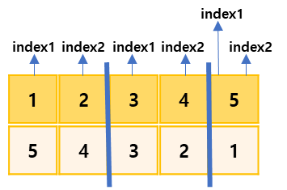
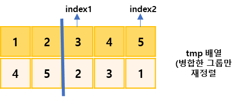
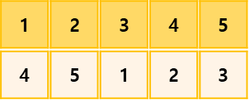
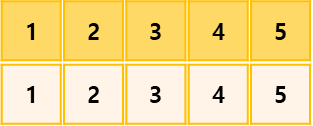

## 수 정렬하기2

https://www.acmicpc.net/problem/2751

-----
N개의 수가 주어졌을 때 이를 오름차순 정렬하는 프로그램을 작성

-----
#### 입력
- 1번째 줄에 수의 개수 N(1 ≦ N ≦ 1,000,000)이 주어진다. 둘째 줄부터 N개의 줄에는 수가 주어진다. 이 수는 절댓값이 1,000,000보다 작거나 같은 정수이다. 수는 중복되지 않는다.

#### 출력
- 1번째 줄부터 N개의 줄에 오름차순으로 정렬한 결과를 한 줄에 하나씩 출력

##### 예제
| 예제 번호 | 예제 입력                                    | 예제 출력                     |
|:------|:-----------------------------------------|---------------------------|
| 1     | 5 // 수의 개수 <br>5 <br>4 <br>3 <br>2 <br>1 | 1 <br>2 <br>3 <br>4 <br>5 |


-----
### 슈도 코드
  ```
N(정렬할 수 개수)
A(정렬할 배열 선언하기)
tmp(정렬할 때 잠시 사용할 임시 배열 선언하기)
for(N의 개수만큼){
    A배열 선언하기
}
병합 정렬 함수 수행하기
결괏값 출력하기
// 병합 정렬 수행하기
병합정렬(s, e) {
    s(시작점), e(종료점), m(중간점)
    // 재귀 함수 형태로 구현하기
    병합 정렬(s, m)
    병합 정렬(m + 1, e)
    for(s ~ e){
        tmp 배열 저장하기
    }
    // 두 그룹을 병합하는 로직
    index1 → 앞쪽 그룹 시작점
    index2 → 뒤쪽 그룹 시작점
    while(index1 <= 중간점 && index <= 종료점){
        양쪽 그룹의 index가 가리키는 값을 비교한 후 더 작은 수를 선택해 배열에 저장하고,
        선택된 데이터의 index 값을 오른쪽을 한 칸 이동하기
        반복문의 끈난 후 남아 있는 데이터 정리하기
    }
}
  ```
-----
### 중요한 점
- N의 최대 범위가 1,000,000이므로 O(nlongn)의 시간 복잡도로 정렬을 수행
- 병합정렬로 정렬을 수행한후 결과를 출력해보기
1. 정렬한 그룹을 최소 길이로 나눕니다. 그림에서 알 수 있듯이 원본 배열의 길이가 5이므로   
2, 2, 1 길이로 나눴습니다. 이제 나눈 그룹마다 병합 정렬합니다. 각 그룹마다 index1, index2를  
지정하여 비교하면서 정렬은 용도로 선언한 tmp배열에 병합 정렬합니다.
  
현재의 경우 그룹이 3개 이므로 2번째, 3번째 그룹을 병합
   
2. 이어서 병합된 그룹을 대상으로 정렬합니다. 위엥서 오른쪽 그룹을 병합할 때는 최초 비교시   
   index2의 값(1)이 선택되어 뒤 세트가 모두 사용됩니다. 이런 경우는 남아 있는 세트(앞세트)의  
   값(2,3)을 뒤에 차례되로 적어 줍니다.  

3. 마지막 정렬입니다. 1, 2, 3, 4, 5순서로 깔끔하게 정렬이 끝났습니다.

### 병합 정렬(merge sort)
- 분할 정복 방식을 사용해 데이터를 분할하고 분할한 집합을 정렬하며 합치는 알고리즘.
- 평균 시간 복잡도 O(nlongn)