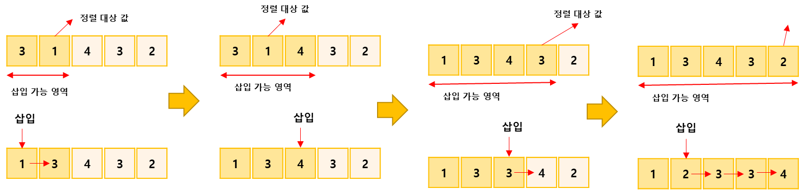
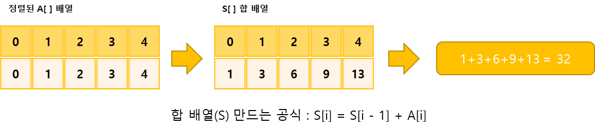

## 소트인사이드(내림차순으로 자릿수 정렬)

https://www.acmicpc.net/problem/11399

-----
인하은행에는 ATM이 1대가 있으며 N명의 사람들이 줄을 서 있다. 이 사람들은 1번에서 N번까지 번호가 있으며, i번 사람이 돈을 인출하는 데 걸리는 시간은
분 이다.  
사람들이 줄을 서는 순서에 따라서 돈을 인출하는 데 필요한 시간의 합이 달라진다.

예) 5명의 사람
일때 

-----
#### 입력
- 1번째 줄에 사람의 수 N(1 ≦ N ≦ 1,000)이 주어진다. 
- 2번째 줄에는 각 사람이 돈을 인출하는데 걸리는 시간 Pi가 주어진다. (1 ≦  ≦ 1,000)

#### 출력
- 1번째 줄에 각 사람이 돈을 인출하는 데 필요한 시간의 합의 최솟값을 출력

##### 예제
| 예제 번호 | 예제 입력 | 예제 출력 |
|:------|:------|-------|
| 1     | 2143  | 4321  |


-----
### 슈도 코드
  ```
N(사람 수)
A(자릿수별로 구분해 저장한 배열)
S(A 합 배열 : 각 사람이 인출을 완료하는 데 필요한 시간을 저장하기)
for(N만큼 반복하기){
    A 배열 저장하기
}
for(i:N만큼 반복하기) {
    for(j: i -1 ~ 0 까지 뒤에서부터 반복하기) {
        현재 범위에서 삽입 위치 찾기
    }
    for(j: i~insert_point + 1까지 뒤에서부터 반복하기) {
        삽입을 위해 삽입 위치에서 i까지 데이터 한 칸씩 뒤로 밀기
    }
    삽입 위치에 현재 데이터 삽입하기
}
for(i: N만큼 반복하기) {
    A 배열을 통한 합 배열 S만들기
}
S 배열의 각 데이터 값을 모두 합해 결과 출력하기
  ```
-----
### 중요한 점
- 그리디 방식으로 해결
- ATM앞에 있는 사람 중 인출 시간이 가장 적게 걸리는 사람이 먼저 인출할 수 있도록 순서를 정하는 것이 그리디 방식
- N의 최댓값이 1,000이고, 시간 제한이 1초이므로 사간복잡도가 O()이하인 정렬 알고리즘중 아무거나 사용가능  
  1. 삽입 정렬을 이용해 인출 시간 를 기준으로 데이터를 오름차순 정렬합니다. 삽입 정렬은 그림만 봐도 이해할 수 있으므로 자세한 설명은 생략  
  
  2. 정렬된 데이터를 바탕으로 모든 사람이 돈을 인출하는 데 필요한 최솟값을 구합니다. 인출에 필요한 시간은 앞사람들의 인출 시간의 합 + 자신의 인출 시간이므로 합 배열로 풉니다.  
  