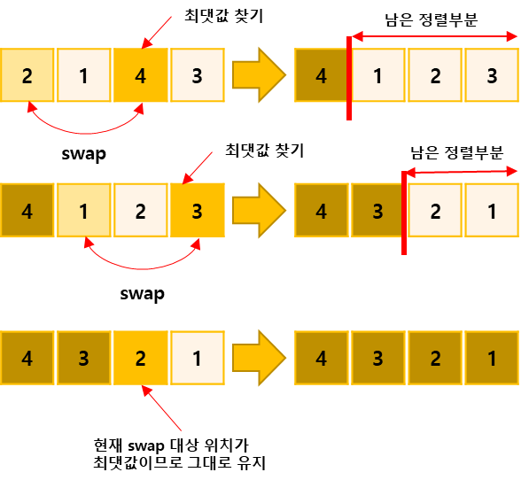

## 소트인사이드(내림차순으로 자릿수 정렬)

https://www.acmicpc.net/problem/1427

-----
배열을 정렬하는 것은 쉽다. 수가 주어지면, 그 수의 각 자리수를 내림차순으로 정렬해보자.

-----
#### 입력
- 1번째 줄에 정렬하려고 하는 수 N이 주어진다. N은 1,000,000,000보다 작거나 같은 자연수이다.

#### 출력
- 1번째 줄에 자릿수를 내림차순으로 정렬한 수를 출력한다.

##### 예제
| 예제 번호 | 예제 입력 | 예제 출력 |
|:------|:------|-------|
| 1     | 2143  | 4321  |


-----
### 슈도 코드
  ```
str(정렬할 수)
arr[자릿수별로 구분해 저장한 배열]
for(str의 길이만큼 반복){
    arr 배열 저장 → str.substrihng 사용하기
}
for(i: 0~str의 길이 만큼 반복){
    for(j: i+1 ~ str의 길이만큼 반복) {
        현재 범위에서 Max값 찾기
    }
    현재 i의 값과 Max값 중 Max값이 더 크면 swap 수행하기
}
arr배열 출력
  ```
-----
### 중요한 점
- String 변수로 정렬할 데이터를 받아 int형 배열에 저장합니다. 이때는 substring()함수를 사용해 숫자를 각 자릿수별로 나눈 후 배열에 저장합니다.
- 배열의 데이터를 선택 정렬 알고리즘을 이용해 내림 차순으로 정렬. 이때 내림차순 정렬이므로 최댓값을 찾아 기준이 되는 자리와 swap합니다.  
  
