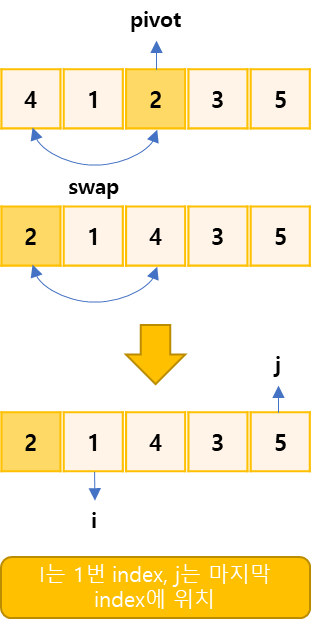
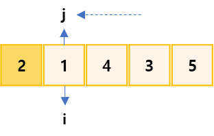
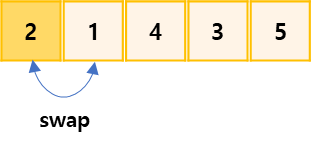
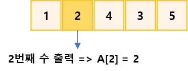

## K번째 수 구하기

https://www.acmicpc.net/problem/11004

-----
수 N개 이 주어진다. A를 오름차순 정렬했을 때, 앞에서부터 K번째 있는 수를 구하는 프로그램을 작성

-----
#### 입력
- 1번째 줄에 N(1 ≦ N ≦ 5,000,000)과 K (1 ≦ K ≦ N)이 주어진다.
- 2번째 줄에는 이 주어진다. ()
#### 출력
- A를 정렬횄을 때 앞에서부터 K번째에 있는 수를 출력

##### 예제
| 예제 번호 | 예제 입력                                | 예제 출력 |
|:------|:-------------------------------------|-------|
| 1     | 5 2 // 데이터의 개수, K번째 수 <br> 4 1 2 3 4 | 2     |


-----
### 슈도 코드
  ```
N(숫자의 개수) K(K번째 수)
A(숫자 데이터 저장 배열)
for(N만큼 반복하기) {
    A배열 저장하기
}
퀵 소스 실행하기
K번째 데이터 출력하기

[별도의 함수 구현 부분]
퀵 소트 함수(시작, 종료, K){
    피벗 구하기 함수(시작, 종료)
    if(피벗 == K) 종료
    else if(K < 피벗) 퀵 소트 수행하기 (시작, 피벗 -1, K)
    else 퀵 소트 수행하기(피벗 + 1, 종료, K)
}
피벗 구하기 함수(시작, 종료){
    중앙값을 피벗으로 설정하기
    i(시작점), j(종료점)
    while(i < j){
        피벗보다 큰 수가 나올 때까지 i++
        피벗보다 작은 수가 나올 때까지 j--
        찾은 i와 j 데이터를 swap
    }
    피벗 데이터를 나눠진 두 그룹의 경계 index에 저장하기
}
  ```
-----
### 중요한 점
- N의 최대 범위가 5,000,000이므로 O(nlogn)의 시간 복잡도로 정렬을 수행하면된다.  
- 이 문제는 시간 복잡도가 민감하므로 퀵 정렬 알고리즘에서 K번째 수를 좀더 빨리 구하기 위한 알고리즘 사용 
- 퀵 정렬 알고리즘을 구현하려면 먼저 pivot을 지정해야한다.
  `pivot을 정하는 방법`  
  `- pivot == K : K번째 수를 찾은 것이므로 알고리즘을 종료`  
  `- pivot > K : pivot의 왼쪽 부분에 K가 있으므로 왼쪽(S ~ pivot - 1)만 정렬을 수행`  
  `- pivot > K : pivot의 왼쪽 부분에 K가 있으므로 왼쪽(S ~ pivot - 1)만 정렬을 수행`
1. 중간 위치를 pivot으로 설정한 다음 맨 앞에 있는 값과 swap합니다. pivot을 맨 앞으로 옮기는 이유는 i, j이동을 편하게 하기 위함입니다. 이어서 i와 j를 pivot을 제외한 그룹에서 왼쪽, 오른쪽 끝으로 정합니다.  
 
2. 우선 j를 이동합니다. j보다 pivot보다 크면 j--연산을 반복합니다. 그 결과 j는 1에 위치하게 됩니다. j를 이동한 후에는 i가 pivot보다 작으면서 i보다 j가 크면 i++ 연산을 반복합니다. 현재의 경우 i와 j의 위치가 같으므로 i는 이동하지 않습니다.  

3. pivot을 두 집합을 나눠 주는 위치, 즉 i와 j가 만난 위치와 swap합니다.  

4. K는 2이므로 이제 더이상 정렬하지 않고 A[2]를 출력합니다.  


### 퀵정렬(Quick sort)
- 기준값(pivot)을 선정해 해당 값보다 작은 데이터와 큰 데이터로 분류하는 것을 반복해 정렬하는 알고리즘
- 평균 시간 복잡도O(nlongn)

 